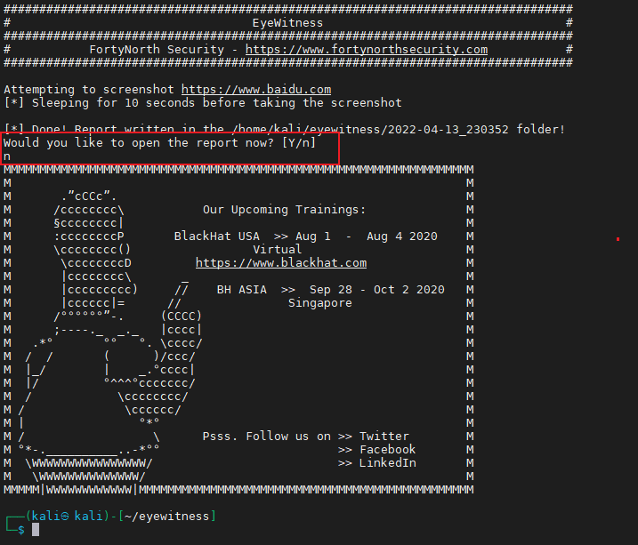
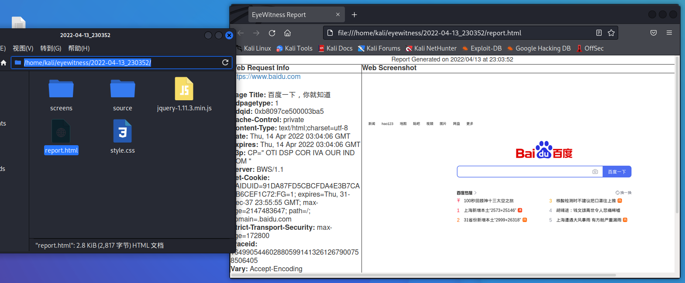

---
# Page title
title: 使用EyeWitness工具识别内网资产

# Date page published
date: 2022-09-10

# Book page type (do not modify).
type: book

# Position of this page in the menu. Remove this option to sort alphabetically.
weight: 10

---


### 简介：

主要就是通过截图的方式去识别网站

### 使用场景：

当内网扫描到大量web资产，通过浏览器手工输入url访问网站效率特别慢，可以通过这个工具批量截图网站页面，快速识别有价值的资产。从而更高效进行横向渗透测试。

### 工具地址：

```bash
https://github.com/FortyNorthSecurity/EyeWitness
```

### 原理：

EyeWitness 将调用 selenium，它使用您系统上安装的实际浏览器（IceWeasel 或 Firefox）来截取屏幕截图。您不会看到浏览器弹出窗口，但它会在后台运行，并截取您提供的 URL 的屏幕截图，并生成简单的报告

### 安装：

```bash
#kali

apt install eyewitness

#windows

好像需要重新编译，没用过windows

```

### 使用指南：

```bash
#作者给的使用指南

https://www.christophertruncer.com/eyewitness-2-0-release-and-user-guide/


################################################################################
#                                  EyeWitness                                  #
################################################################################
#           FortyNorth Security - https://www.fortynorthsecurity.com           #
################################################################################

usage: EyeWitness.py [--web] [-f Filename] [-x Filename.xml] [--single Single URL] [--no-dns] [--timeout Timeout] [--jitter # of Seconds]
                     [--delay # of Seconds] [--threads # of Threads] [--max-retries Max retries on a timeout] [-d Directory Name]
                     [--results Hosts Per Page] [--no-prompt] [--user-agent User Agent] [--difference Difference Threshold]
                     [--proxy-ip 127.0.0.1] [--proxy-port 8080] [--proxy-type socks5] [--show-selenium] [--resolve]
                     [--add-http-ports ADD_HTTP_PORTS] [--add-https-ports ADD_HTTPS_PORTS] [--only-ports ONLY_PORTS] [--prepend-https]
                     [--selenium-log-path SELENIUM_LOG_PATH] [--resume ew.db]

EyeWitness is a tool used to capture screenshots from a list of URLs

Protocols:
  --web                 HTTP Screenshot using Selenium

Input Options:
  -f Filename           Line-separated file containing URLs to capture
  -x Filename.xml       Nmap XML or .Nessus file
  --single Single URL   Single URL/Host to capture
  --no-dns              Skip DNS resolution when connecting to websites

Timing Options:
  --timeout Timeout     Maximum number of seconds to wait while requesting a web page (Default: 7)
  --jitter # of Seconds
                        Randomize URLs and add a random delay between requests
  --delay # of Seconds  Delay between the opening of the navigator and taking the screenshot
  --threads # of Threads
                        Number of threads to use while using file based input
  --max-retries Max retries on a timeout
                        Max retries on timeouts

Report Output Options:
  -d Directory Name     Directory name for report output
  --results Hosts Per Page
                        Number of Hosts per page of report
  --no-prompt           Don't prompt to open the report

Web Options:
  --user-agent User Agent
                        User Agent to use for all requests
  --difference Difference Threshold
                        Difference threshold when determining if user agent requests are close "enough" (Default: 50)
  --proxy-ip 127.0.0.1  IP of web proxy to go through
  --proxy-port 8080     Port of web proxy to go through
  --proxy-type socks5   Proxy type (socks5/http)
  --show-selenium       Show display for selenium
  --resolve             Resolve IP/Hostname for targets
  --add-http-ports ADD_HTTP_PORTS
                        Comma-separated additional port(s) to assume are http (e.g. '8018,8028')
  --add-https-ports ADD_HTTPS_PORTS
                        Comma-separated additional port(s) to assume are https (e.g. '8018,8028')
  --only-ports ONLY_PORTS
                        Comma-separated list of exclusive ports to use (e.g. '80,8080')
  --prepend-https       Prepend http:// and https:// to URLs without either
  --selenium-log-path SELENIUM_LOG_PATH
                        Selenium geckodriver log path

Resume Options:
  --resume ew.db        Path to db file if you want to resume

```

### 简单使用：

```bash
#单个目标
eyewitness --single 'https://www.baidu.com' --web -d ./output --delay 10

#多个目标

eyewitness -f ./url.txt --web -d ./output --delay 10

#参数使用说明

--single :单个网站

--web  识别web页面

-d 输出目录

--delay 打开网站后延迟截图的时间（不设置的话截图太快，可能网站还没渲染完），单位：秒


```

### 使用效果：

扫描结束会询问你是否现在打开报告，这里选择否我们自己打开就行





### 使用proxychains代理

> 📌这里有几个需要注意的坑

*   **确保EyeWitness执行目录权限可写**

    在执行的目录下`chmod 777 -R ./`

*   **不支持在低权限用户以root身份运行（使用sudo）**

    好像Firefox的原因

*   **proxychains低版本执行会报错**

    下载最新的[proxychains-ng](https://github.com/rofl0r/proxychains-ng "proxychains-ng")版本

    ```bash
    git clone https://github.com/rofl0r/proxychains-ng ~/proxychains-ng
    cd ~/proxychains-ng
    make -s clean
    ./configure --prefix=/usr --sysconfdir=/etc
    make -s
    make -s install
    ln -sf /usr/bin/proxychains4 /usr/local/bin/proxychains-ng


    修改/etc/proxychains.conf  (可能是/etc/proxychains4.conf)

    #将下面的一行添加到proxychains.conf，只要它不在“[ProxyList]”下的最底部，任何地方都可以使用，建议将它添加到“proxy_dns”之后

    localnet 127.0.0.0/255.0.0.0


    #代理使用

    proxychains-ng eyewitness -f ./url.txt --web -d ./output --delay 10


    ```
